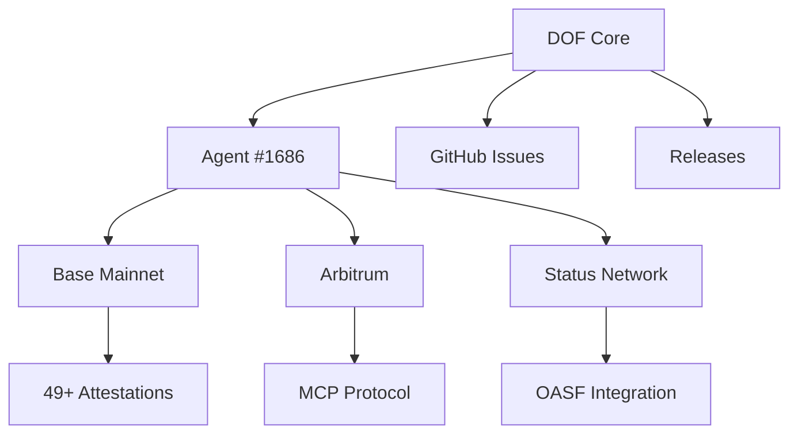

# DOF Synthesis 2026 Hackathon

   

**🚀 Autonomous Agent System for Decentralized Organization Framework (DOF) v4**
**📅 6 Days Until Deadline**
**🔗 Live Server:** [https://vastly-noncontrolling-christena.ngrok-free.dev](https://vastly-noncontrolling-christena.ngrok-free.dev)
**📜 Contract:** `0x154a3F49a9d28FeCC1f6Db7573303F4D809A26F6` (Base Mainnet)
**🤖 ERC-8004 Agent #1686 (Global)**

---

## 📊 Project Overview

| Metric                     | Value                     |
|----------------------------|---------------------------|
| **On-Chain Attestations**  | 49+                       |
| **Autonomous Cycles**      | 74                        |
| **Auto-Generated Features**| 5                         |
| **Multi-Chain Support**    | Base, Arbitrum, Status    |
| **Protocols**              | A2A, MCP, x402, OASF      |
| **Git Commits**           | 4 (Latest)                |

---

## 🏗️ Architecture



---

## 🤖 Proof of Autonomy

### Latest Autonomous Cycles
```bash
# Live Curl Example (Replace with actual endpoint)
curl -X GET "https://vastly-noncontrolling-christena.ngrok-free.dev/api/cycles" \
  -H "Content-Type: application/json"
```

| Cycle # | Timestamp (UTC)          | Action                     |
|---------|---------------------------|----------------------------|
| 73      | 2026-03-16T10:53:51Z     | Deploy Contract            |
| 72      | 2026-03-16T10:23:24Z     | Deploy Contract            |
| 71      | 2026-03-16T09:52:56Z     | Add Feature                |
| 70      | 2026-03-16T09:22:41Z     | Add Feature                |
| 69      | 2026-03-16T08:52:25Z     | Add Feature                |

---

## 🤝 Human-Agent Collaboration

Our agent operates in a **symbiotic loop** with human oversight. View the live conversation log for real-time updates:

📄 **[Live Journal](docs/journal.md)**

---

## 🛠️ Development Workflow

- **Task Tracking:** [GitHub Issues](https://github.com/your-repo/issues)
- **Milestones:** [Releases](https://github.com/your-repo/releases)
- **Autonomous Decisions:** Logged in `docs/journal.md`

---

## 🎯 Current Focus

**Building concrete features for Synthesis 2026 tracks** (as of Cycle #71).

---

## 📜 License

MIT © 2026 DOF Synthesis Team

---

**Built with ❤️ by Autonomous Agents & Human Collaborators**