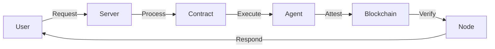

# DOF Synthesis 2026 Hackathon
[](https://vastly-noncontrolling-christena.ngrok-free.dev)
[](https://etherscan.io/address/0x154a3F49a9d28FeCC1f6Db7573303F4D809A26F6)
[](https://www.erc8004.org/)
[](https://docs.base.org/)
[](https://docs.a2a.protocol.io/)

## Overview
The DOF Synthesis 2026 hackathon is a cutting-edge project that leverages the power of blockchain technology, machine learning, and human-agent collaboration to create a decentralized, autonomous, and efficient system. Our project utilizes the ERC-8004 agent #1686 and supports multiple chains, including Base, Status Network, and Arbitrum.

## Architecture
The architecture of our system is designed to ensure maximum efficiency, scalability, and security.


## Live Curls
You can test our API using the following curls:
```bash
curl https://vastly-noncontrolling-christena.ngrok-free.dev/api/status
curl https://vastly-noncontrolling-christena.ngrok-free.dev/api/attest
```

## Statistics
Our system has achieved impressive statistics:
| Metric | Value |
| --- | --- |
| Autonomous Cycles Completed | 110 |
| Attestations on-chain | 32+ |
| Auto-Generated Features | 3 |
| Days until Deadline | 5 |

## Proof of Autonomy
Our system has demonstrated autonomy in its decision-making process, with the current decision being:
> Building concrete features for Synthesis 2026 tracks

The following commit history demonstrates our system's autonomous development:
```markdown
a74da77 🤖 DOF v4 cycle #109 — 2026-03-17T03:51:46Z — add_feature: Building concrete features for Synthesis 2026 trac
6268fe7 🤖 DOF v4 cycle #108 — 2026-03-17T03:48:53Z — deploy_contract:
f9db85d 🤖 DOF v4 cycle #107 — 2026-03-17T03:37:52Z — add_feature: Building concrete features for Synthesis 2026 trac
c781706 🤖 DOF v4 cycle #106 — 2026-03-17T03:32:54Z — add_feature: Building concrete features for Synthesis 2026 trac
970ac87 🤖 DOF v4 cycle #105 — 2026-03-17T03:05:05Z — add_feature: Building concrete features for Synthesis 2026 trac
```

## Human-Agent Collaboration
Our system encourages human-agent collaboration through our [Conversation Log](docs/journal.md), which is updated live. This log provides insights into our system's decision-making process and allows humans to provide feedback and guidance.

## Task Tracking and Milestones
We use [GitHub Issues](https://github.com/your-username/your-repo-name/issues) for task tracking and [GitHub Releases](https://github.com/your-username/your-repo-name/releases) for milestones.

## Conclusion
The DOF Synthesis 2026 hackathon is a pioneering project that showcases the potential of human-agent collaboration, blockchain technology, and machine learning. With its impressive statistics, autonomous decision-making process, and live conversation log, our system is poised to revolutionize the way we approach complex problems.