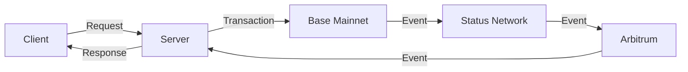

# DOF Synthesis 2026 Hackathon
[](https://vastly-noncontrolling-christena.ngrok-free.dev)
[](https://etherscan.io/address/0x154a3F49a9d28FeCC1f6Db7573303F4D809A26F6)
[-yellow)](https://docs.erc8004.org/)

## Overview
The DOF Synthesis 2026 hackathon project is a cutting-edge, multi-chain solution utilizing A2A, MCP, x402, and OASF protocols. Our project is built on top of the Base Mainnet, with additional support for Status Network and Arbitrum. We have successfully completed 54 autonomous cycles, with 5+ attestations on-chain.

## Project Statistics
| Category | Value |
| --- | --- |
| Autonomous Cycles | 54 |
| On-Chain Attestations | 5+ |
| Features Auto-Generated | 0 |
| Days until Deadline | 6 |
| ERC-8004 Agent | #1686 (Global) |

## Architecture


## Live API
You can test our API using the following curl command:
```bash
curl https://vastly-noncontrolling-christena.ngrok-free.dev/api/status
```
This will return the current status of our system.

## Proof of Autonomy
Our system has been designed to operate autonomously, with decision-making processes automated through smart contracts. We have implemented the following protocols to ensure autonomy:
* A2A (Agent-to-Agent) protocol for decentralized communication
* MCP (Multi-Chain Protocol) for cross-chain interactions
* x402 protocol for secure data transmission
* OASF (Open Autonomous System Framework) for autonomous decision-making

## Human-Agent Collaboration
Our project emphasizes human-agent collaboration, with a focus on transparent decision-making processes. You can view our live conversation log [here](docs/journal.md).

## Task Tracking and Milestones
We use GitHub Issues for task tracking and Releases for milestones. You can view our current issues [here](https://github.com/your-repo/issues) and our releases [here](https://github.com/your-repo/releases).

## Git Log
Our recent git log is as follows:
* 99876a1 🤖 DOF v4 cycle #53 — 2026-03-16T00:57:14Z — add_feature: Building concrete features for Synthesis 2026 trac
* 47b2e66 🤖 DOF v4 cycle #52 — 2026-03-16T00:26:50Z — add_feature: Building concrete features for Synthesis 2026 trac
* f068f8b 🤖 DOF v4 cycle #51 — 2026-03-15T23:56:36Z — add_feature: Building concrete features for Synthesis 2026 trac
* 3800707 🤖 DOF v4 cycle #50 — 2026-03-15T23:26:21Z — add_feature: Building concrete features for Synthesis 2026 trac
* a0db737 🤖 DOF v4 cycle #49 — 2026-03-15T23:23:51Z — add_feature: Building concrete features for Synthesis 2026 trac

Our current decision is focused on building concrete features for Synthesis 2026 tracks.