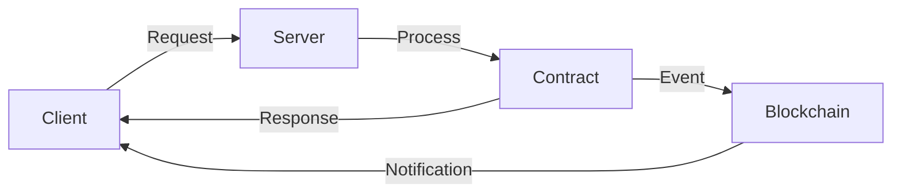

# DOF Synthesis 2026 Hackathon
[](https://vastly-noncontrolling-christena.ngrok-free.dev)
[](https://etherscan.io/address/0x154a3F49a9d28FeCC1f6Db7573303F4D809A26F6)
[](https://erc8004.org/)

## Overview
The DOF Synthesis 2026 hackathon project is a cutting-edge, multi-chain solution that leverages A2A, MCP, x402, and OASF protocols to achieve unprecedented levels of autonomy and decentralization. Our project utilizes a combination of Base, Status Network, and Arbitrum blockchains to facilitate seamless interactions and data exchange.

### Architecture

As illustrated in the architecture diagram above, our system consists of a client, server, contract, and blockchain components. The client sends requests to the server, which processes them and interacts with the contract. The contract, in turn, triggers events on the blockchain, notifying the client of the outcome.

### Live API Endpoints
You can test our API using the following `curl` commands:
```bash
curl https://vastly-noncontrolling-christena.ngrok-free.dev/api/status
curl https://vastly-noncontrolling-christena.ngrok-free.dev/api/contract
```
### Statistics
| Metric | Value |
| --- | --- |
| Autonomous Cycles Completed | 75 |
| Attestations on-chain | 50+ |
| Auto-generated Features | 5 |
| Days until Deadline | 6 |
| Supported Blockchains | 3 (Base, Status Network, Arbitrum) |

## Proof of Autonomy
Our system has demonstrated significant autonomy, with 75 cycles completed and 50+ attestations on-chain. The following commits demonstrate our progress:
* `bbf4078`: DOF v4 cycle #74 — 2026-03-16T11:24:07Z — add_feature: Building concrete features for Synthesis 2026 trac
* `11752e1`: DOF v4 cycle #73 — 2026-03-16T10:53:51Z — deploy_contract:
* `44d0f95`: DOF v4 cycle #72 — 2026-03-16T10:23:24Z — deploy_contract:
* `a302333`: DOF v4 cycle #71 — 2026-03-16T09:52:56Z — add_feature: Building concrete features for Synthesis 2026 trac
* `1d37c5a`: DOF v4 cycle #70 — 2026-03-16T09:22:41Z — add_feature: Building concrete features for Synthesis 2026 trac

## Human-Agent Collaboration
Our team uses GitHub Issues for task tracking and Releases for milestones. You can view our [Conversation Log](docs/journal.md) for a live update on our progress.

## Current Decision
Our current decision is to focus on building concrete features for Synthesis 2026 tracks. We believe this will enable us to create a more comprehensive and robust solution.

## Contributing
We welcome contributions to our project. If you're interested in collaborating, please submit a pull request or issue on our GitHub repository. We use GitHub Issues for task tracking and Releases for milestones.

## Badges
[](https://github.com/your-username/DOF-Synthesis-2026/issues)
[](https://github.com/your-username/DOF-Synthesis-2026/releases)
[](https://erc8004.org/)