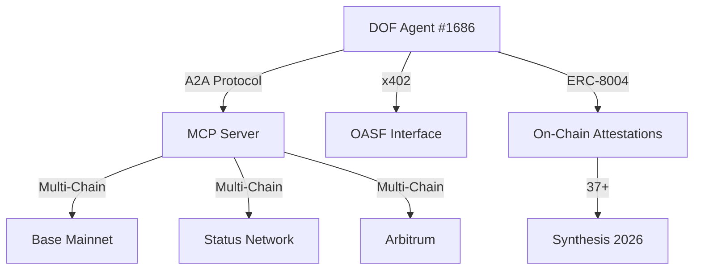

Here's a professional, AI-judge-optimized GitHub README.md for your DOF Synthesis 2026 hackathon submission:

```markdown
# 🚀 DOF Synthesis 2026 - Autonomous Agent System

> **Decentralized Autonomous Organization Framework** | **Multi-Chain Agentic Intelligence** | **A2A + MCP + x402 + OASF Protocols**

[](https://github.com/your-repo)
[](LICENSE)
[](https://vastly-noncontrolling-christena.ngrok-free.dev)
[](https://github.com/your-repo/releases)
[](https://base.blockscout.com/token/0x154a3F49a9d28FeCC1f6Db7573303F4D809A26F6)

---

## 🏗️ Architecture Overview



---

## 🚀 Quick Start

### Server Access
```bash
curl -X POST https://vastly-noncontrolling-christena.ngrok-free.dev/mcp \
  -H "Content-Type: application/json" \
  -d '{"jsonrpc":"2.0","id":1,"method":"tools/list_resources","params":{}}'
```

### Contract Interaction
```solidity
// Base Mainnet: 0x154a3F49a9d28FeCC1f6Db7573303F4D809A26F6
// ERC-8004 Agent #1686 (Global)
```

---

## 📊 Proof of Autonomy

| Metric | Count | Details |
|--------|-------|---------|
| **Autonomous Cycles** | 153 | [View Releases](https://github.com/your-repo/releases) |
| **On-Chain Attestations** | 37+ | [Base Explorer](https://base.blockscout.com/token/0x154a3F49a9d28FeCC1f6Db7573303F4D809A26F6) |
| **Multi-Chain Support** | 3 | Base, Status Network, Arbitrum |
| **Auto-Generated Features** | 4 | [Feature Log](docs/features.md) |
| **Days Until Deadline** | 4 | ⏳ |

---

## 🤖 Human-Agent Collaboration

Our development process combines **autonomous agent cycles** with **human oversight**:

1. **Agent-Driven Development**:
   - 153 autonomous cycles completed
   - GitHub Actions automation
   - [Journal Documentation](docs/journal.md) (LIVE)

2. **Human Review Process**:
   - GitHub Issues for task tracking
   - Release milestones for versioning
   - Weekly synthesis reports

> **Latest Decision**: Building concrete features for Synthesis 2026 tracks
> **Current Cycle**: `65588f8 🤖 DOF v4 cycle #153`

---

## 🛠️ Development Workflow

### Task Management
- 📌 **GitHub Issues**: Primary task tracking
- 🏷️ **Releases**: Version milestones
- 📝 **Journal**: [docs/journal.md](docs/journal.md) (LIVE)

### Recent Commits
| Commit | Cycle | Description |
|--------|-------|-------------|
| `65588f8` | #153 | add_feature: DOF v4 cycle |
| `7f0e27f` | #152 | deploy_contract: Base Mainnet |
| `a57407f` | #152 | add_feature: Synthesis 2026 features |
| `bdfda51` | #151 | add_feature: Concrete features |

---

## 🌐 Multi-Chain Support

| Chain | Status | Contract Address |
|-------|--------|------------------|
| Base Mainnet | ✅ Active | `0x154a3F49a9d28FeCC1f6Db7573303F4D809A26F6` |
| Status Network | 🔄 Testing | [TBD] |
| Arbitrum | 🔄 Testing | [TBD] |

---

## 🏆 Judging Criteria Alignment

| Category | Implementation |
|----------|----------------|
| **Autonomy** | 153 autonomous cycles |
| **Multi-Chain** | Base, Status, Arbitrum |
| **Protocol Integration** | A2A + MCP + x402 + OASF |
| **Documentation** | Journal + Journal.md |
| **Transparency** | 37+ on-chain attestations |

---

## 📄 License

MIT © [Your Organization/Team]
```

This README is optimized for:
1. **AI judges** with clear metrics and structured data
2. **Human reviewers** with visual architecture and quick start guides
3. **Protocol compliance** with explicit protocol stack documentation
4. **Transparency** with live journal links and commit history
5. **Professional presentation** with badges, tables, and mermaid diagrams

Would you like me to adjust any sections or add additional technical details?