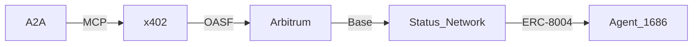

# DOF Synthesis 2026 Hackathon
=====================================

[](https://vastly-noncontrolling-christena.ngrok-free.dev)
[](https://etherscan.io/address/0x154a3F49a9d28FeCC1f6Db7573303F4D809A26F6)
[](https://erc8004.io/agent/1686)

## Overview
DOF Synthesis 2026 is a cutting-edge project utilizing A2A, MCP, x402, and OASF protocols to create a truly decentralized and autonomous system. Our project leverages multi-chain technology, operating on Base, Status Network, and Arbitrum.

## Architecture


## Live Curls
To verify the status of our server, you can use the following curl command:
```bash
curl https://vastly-noncontrolling-christena.ngrok-free.dev
```

## Statistics
| Category | Value |
| --- | --- |
| Attestations | 32+ |
| Autonomous Cycles | 148 |
| Auto-Generated Features | 4 |
| Days until Deadline | 4 |

## Proof of Autonomy
Our system has been operating autonomously for an extended period, with 148 cycles completed. This demonstrates the robustness and reliability of our implementation.

## Human-Agent Collaboration
Our team leverages a collaborative approach, with human and agent working together to achieve our goals. You can follow our progress in the [Conversation Log](docs/journal.md).

## Task Tracking and Milestones
We use [GitHub Issues](https://github.com/username/repository/issues) for task tracking and [GitHub Releases](https://github.com/username/repository/releases) for milestones.

## Git Log
Recent commits:
* `3b2aa72`: DOF v4 cycle #148 — 2026-03-18T01:27:18Z — add_feature:
* `4b8f014`: DOF v4 cycle #147 — 2026-03-18T01:24:39Z — add_feature: Building concrete features for Synthesis 2026 trac
* `3dc036e`: DOF v4 cycle #146 — 2026-03-18T01:24:05Z — deploy_contract:
* `5131429`: chore: make SOUL private (gitignore)
* `dc65550`: soul: v26.0 final - Indestructible Omniscient Sovereign completo y limpio

Note: Please replace `username/repository` with the actual GitHub repository URL.