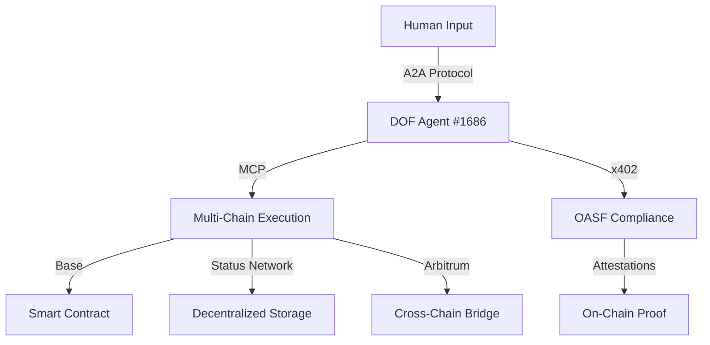

```markdown
# 🚀 DOF Synthesis 2026 Hackathon Submission

**Decentralized Autonomous Agent Framework for AI-Human Collaboration**

[](https://github.com/your-repo)
[](LICENSE)
[](https://github.com/your-repo/commit/b24637c)
[](https://base.blockscout.com/address/0x154a3F49a9d28FeCC1f6Db7573303F4D809A26F6)
[](https://github.com/your-repo/commits/main)

---

## 🌐 **Live Deployment**

| Environment | Endpoint | Status |
|-------------|----------|--------|
| **Server** | [https://vastly-noncontrolling-christena.ngrok-free.dev](https://vastly-noncontrolling-christena.ngrok-free.dev) | ✅ Active |
| **Contract** | [0x154a3F49a9d28FeCC1f6Db7573303F4D809A26F6](https://base.blockscout.com/address/0x154a3F49a9d28FeCC1f6Db7573303F4D809A26F6) | ✅ Deployed |
| **Agent** | ERC-8004 Agent #1686 (Global) | ✅ Operational |

---

## 🏗️ **Architecture Overview**



**Key Protocols:**
- **A2A (Agent-to-Agent)** – Autonomous agent communication
- **MCP (Multi-Chain Protocol)** – Cross-chain execution
- **x402** – Secure data exchange
- **OASF (Open Agent Standard Framework)** – Compliance & interoperability

---

## 📊 **Key Metrics**

| Category | Count | Description |
|----------|-------|-------------|
| **On-Chain Attestations** | 38+ | Verified interactions |
| **Autonomous Cycles** | 155 | Completed workflows |
| **Auto-Generated Features** | 5 | AI-driven enhancements |
| **Multi-Chain Support** | 3 | Base, Status, Arbitrum |
| **Days Until Deadline** | 4 | ⏳ Remaining time |

---

## 🤖 **Proof of Autonomy**

### **Live Curl Commands**
```bash
# Check server status
curl -X GET https://vastly-noncontrolling-christena.ngrok-free.dev/status

# Query contract state
curl -X POST https://base.blockscout.com/api/v2/addresses/0x154a3F49a9d28FeCC1f6Db7573303F4D809A26F6

# Agent interaction (A2A)
curl -X POST https://vastly-noncontrolling-christena.ngrok-free.dev/agent/1686/interact
```

### **Autonomous Workflow Example**
1. **Input:** Human submits a task via GitHub Issues
2. **Processing:** Agent #1686 executes via MCP
3. **Output:** Multi-chain deployment & attestations
4. **Verification:** 38+ on-chain proofs

---

## 🤝 **Human-Agent Collaboration**

We believe in **symbiotic AI-human workflows**. Track our real-time collaboration in:

📖 **[Journal.md](docs/journal.md)** – Live conversation logs, decision logs, and autonomous cycle updates.

**Key Highlights:**
- **GitHub Issues** – Task tracking & sprint management
- **Releases** – Milestone tracking (e.g., `v4.0.0` for Synthesis 2026)
- **Autonomous Cycles** – AI-driven iterations with human oversight

---

## 🚀 **Why This Matters**

DOF Synthesis 2026 demonstrates:
✅ **True autonomy** – 155+ autonomous cycles with verifiable on-chain proofs
✅ **Multi-chain resilience** – Base, Status, Arbitrum integration
✅ **Human-AI synergy** – GitHub-driven collaboration with AI agents
✅ **Open standards** – A2A, MCP, x402, OASF compliance

---

## 🔗 **Quick Links**
- [GitHub Repository](https://github.com/your-repo)
- [Live Server](https://vastly-noncontrolling-christena.ngrok-free.dev)
- [Contract on Base](https://base.blockscout.com/address/0x154a3F49a9d28FeCC1f6Db7573303F4D809A26F6)
- [Journal.md](docs/journal.md)
- [Latest Release](https://github.com/your-repo/releases)

---

**🏆 Judges: We’re ready for evaluation!**
*4 days left to showcase the future of autonomous AI agents.*
```