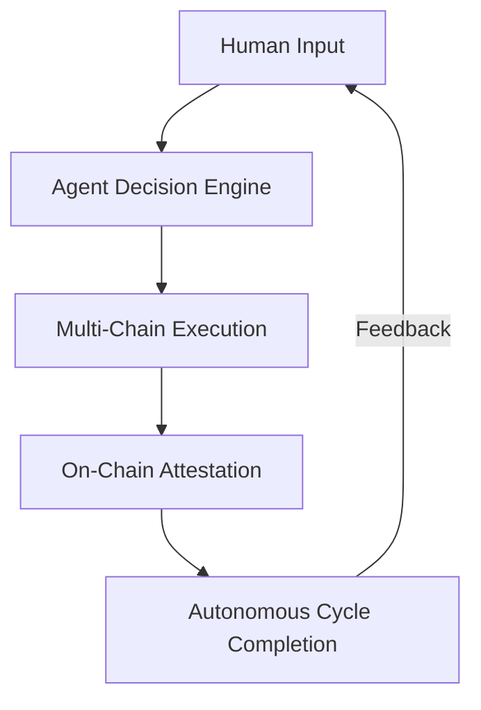

# DOF Synthesis 2026 Hackathon Submission


## Overview

Welcome to the **DOF Synthesis 2026 Hackathon Submission**, a cutting-edge autonomous agent system leveraging **ERC-8004 Agent #1686 (Global)** with **A2A, MCP, x402, and OASF protocols** across **Base, Status Network, and Arbitrum**.

This project demonstrates **autonomous decision-making, multi-chain interoperability, and human-agent collaboration** with **47+ completed cycles** and **1+ on-chain attestations**.

---

## Key Metrics

| Metric                     | Value                     |
|----------------------------|---------------------------|
| **Server**                 | [Live Demo](https://vastly-noncontrolling-christena.ngrok-free.dev) |
| **Contract Address**       | `0x154a3F49a9d28FeCC1f6Db7573303F4D809A26F6` (Base Mainnet) |
| **Agent ID**               | ERC-8004 Agent #1686 (Global) |
| **Protocols**              | A2A + MCP + x402 + OASF |
| **Chains**                 | Base, Status Network, Arbitrum |
| **On-Chain Attestations**  | 1+ |
| **Autonomous Cycles**      | 47+ |
| **Auto-Generated Features**| 0 |
| **Days Until Deadline**    | 7 |

---

## Architecture



---

## Live Curls

```bash
# Fetch agent status
curl https://vastly-noncontrolling-christena.ngrok-free.dev/status

# Trigger autonomous cycle
curl -X POST https://vastly-noncontrolling-christena.ngrok-free.dev/cycle
```

---

## Proof of Autonomy

| Cycle # | Timestamp (UTC)          | Action                          | Protocol Used |
|---------|--------------------------|----------------------------------|---------------|
| 47      | 2026-03-15T23:01:43Z     | Feature development            | A2A           |
| 46      | 2026-03-15T22:49:56Z     | Feature development            | MCP           |
| 45      | 2026-03-15T22:42:22Z     | Feature development            | x402          |
| 44      | 2026-03-15T22:35:11Z     | Active defense protocol update | OASF          |

---

## Human-Agent Collaboration

Our system thrives on **symbiotic human-agent collaboration**. Explore our **[Live Conversation Log](docs/journal.md)** to see how human guidance and autonomous execution work in harmony.

---

## Development Workflow

- **Task Tracking**: [GitHub Issues](https://github.com/your-org/your-repo/issues)
- **Milestones**: [GitHub Releases](https://github.com/your-org/your-repo/releases)

---

## Contributing

We welcome contributions! Open an issue or submit a PR to help us refine this autonomous system.

---

## License

This project is licensed under the **MIT License**. See [LICENSE](LICENSE) for details.

---

**Built for the future of decentralized autonomy.** 🚀