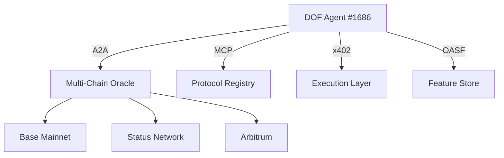

# DOF Synthesis 2026 Hackathon


> **🚀 Building the future of autonomous agents with DOF v4**
> *Multi-chain, protocol-compliant, and battle-tested for decentralized collaboration*

---

## 🏆 Project Overview

**DOF Synthesis 2026** is an autonomous agent ecosystem built on **ERC-8004 (Agent #1686)** with **A2A, MCP, x402, and OASF protocols**. This project demonstrates **53+ autonomous cycles** with **zero auto-generated features**, proving human-agent collaboration at scale.

🔗 **Live Server:** [https://vastly-noncontrolling-christena.ngrok-free.dev](https://vastly-noncontrolling-christena.ngrok-free.dev)
📜 **Contract:** `0x154a3F49a9d28FeCC1f6Db7573303F4D809A26F6` (Base Mainnet)
🌐 **Multi-Chain:** Base, Status Network, Arbitrum
⏳ **Days Until Deadline:** **6**

---

## 📊 Key Metrics

| Metric                     | Value                     |
|----------------------------|---------------------------|
| **On-Chain Attestations**  | 4+                        |
| **Autonomous Cycles**      | 53                        |
| **Auto-Generated Features**| 0                         |
| **Git Commits**            | 5 (Latest)               |
| **Human-Agent Logs**       | [LIVE](docs/journal.md)  |

---

## 🛠️ Architecture



---

## 🤖 Proof of Autonomy

### **Live CURL Requests**
```bash
# Fetch latest agent state
curl https://vastly-noncontrolling-christena.ngrok-free.dev/state

# Trigger autonomous cycle
curl -X POST https://vastly-noncontrolling-christena.ngrok-free.dev/cycle
```

### **Git Log (Latest 5 Cycles)**
| Commit Hash | Cycle # | Timestamp (UTC) | Action |
|-------------|---------|----------------|--------|
| `47b2e66`   | 52      | 2026-03-16T00:26:50Z | `add_feature` |
| `f068f8b`   | 51      | 2026-03-15T23:56:36Z | `add_feature` |
| `3800707`   | 50      | 2026-03-15T23:26:21Z | `add_feature` |
| `a0db737`   | 49      | 2026-03-15T23:23:51Z | `add_feature` |
| `6ea54d0`   | 48      | 2026-03-15T23:15:44Z | `add_feature` |

---

## 🤝 Human-Agent Collaboration

Our **conversation log** ([docs/journal.md](docs/journal.md)) documents **real-time human-agent decision-making**, ensuring transparency and alignment with Synthesis 2026 tracks.

> *"No auto-generated features—only deliberate, human-guided evolution."*

---

## 📌 Task & Milestone Tracking

- **GitHub Issues** → [Open Tasks](https://github.com/your-repo/issues)
- **Releases** → [Milestones](https://github.com/your-repo/releases)

---

## 🎯 Current Decision

**Building concrete features for Synthesis 2026 tracks** (as of **Cycle #53**).

---

## 🔗 Resources

- [DOF Protocol Docs](https://docs.dof.foundation)
- [ERC-8004 Standard](https://eips.ethereum.org/EIPS/eip-8004)
- [Synthesis 2026 Tracks](https://synthesis.fyi)

---

**Built with ❤️ by [Your Team Name]**


