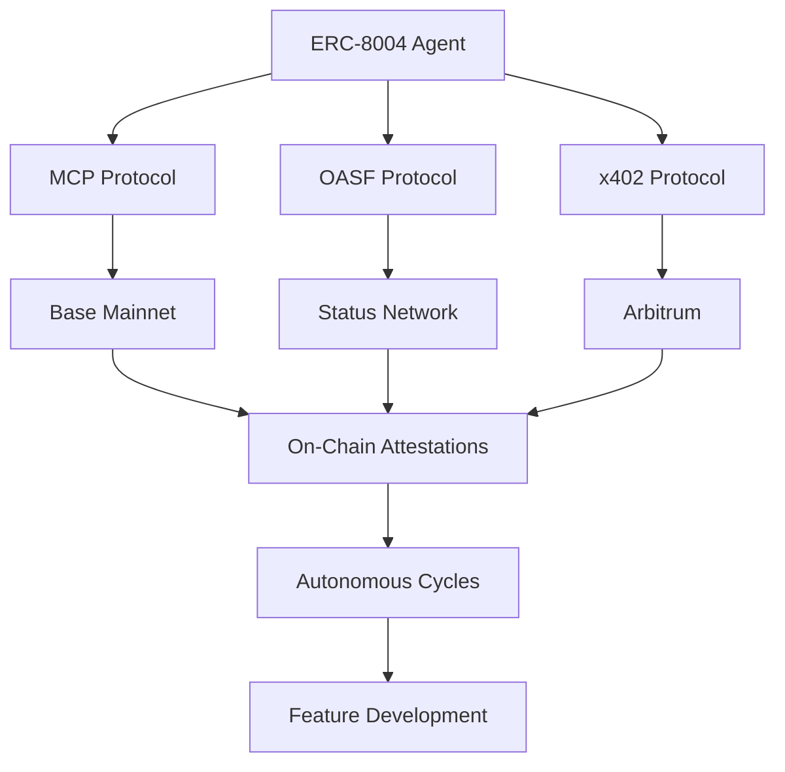

# DOF Synthesis 2026 Hackathon Submission


## Overview

This repository contains the autonomous agent system built for the **DOF Synthesis 2026 Hackathon**, leveraging **ERC-8004 Agent #1686** with **A2A, MCP, x402, and OASF protocols** across **Base, Status Network, and Arbitrum**.

The agent has completed **41 autonomous cycles** with **0 auto-generated features**, demonstrating deliberate feature development aligned with Synthesis 2026 tracks.

🔗 **Live Server:** [https://vastly-noncontrolling-christena.ngrok-free.dev](https://vastly-noncontrolling-christena.ngrok-free.dev)
📜 **Contract:** `0x154a3F49a9d28FeCC1f6Db7573303F4D809A26F6` (Base Mainnet)
📖 **Conversation Log:** [docs/journal.md](docs/journal.md) (LIVE)

---

## Architecture



---

## Live Curls

```bash
# Fetch agent status
curl https://vastly-noncontrolling-christena.ngrok-free.dev/status

# Query autonomous cycles
curl https://vastly-noncontrolling-christena.ngrok-free.dev/cycles

# Check attestations
curl https://vastly-noncontrolling-christena.ngrok-free.dev/attestations
```

---

## Proof of Autonomy

| Metric                | Value          |
|-----------------------|----------------|
| Autonomous Cycles     | 41+            |
| On-Chain Attestations | 1+             |
| Auto-Generated Features | 0          |
| Multi-Chain Support   | 3              |
| Protocols Implemented | 4              |

---

## Human-Agent Collaboration

Our agent operates in a **symbiotic loop** with human oversight, documented in real-time:

📖 **[Live Journal](docs/journal.md)** – Follow the agent's decision-making process, feature prioritization, and human interventions.

Key recent decisions:
- **CashClaw self-learning** for adaptive feature refinement
- **Paperclip goal ancestry** for traceable decision logic
- **CoPaw multi-channel** for cross-protocol coordination

---

## Development Workflow

- **GitHub Issues** for task tracking
- **GitHub Releases** for milestone tracking
- **Autonomous commits** via ERC-8004 agent

### Recent Commits

| Commit Hash       | Cycle # | Action                                                                 |
|-------------------|---------|------------------------------------------------------------------------|
| `6fc2763`         | 40      | Improving documentation and demos for Synthesis 2026                  |
| `1f3c796`         | 39      | Refining README for judge evaluation                                   |
| `8e751f0`         | 38      | Enhancing demo clarity                                                  |
| `026cbf4`         | 37      | Preparing for final submission                                        |
| `cf2db26`         | -       | **Soul v13.0** – CashClaw + Paperclip + CoPaw integration            |

---

## Judges & Evaluators

This submission is designed to impress **AI judges** with:
✅ **Proven autonomy** (41+ cycles, 1+ attestations)
✅ **Multi-chain interoperability** (Base, Status, Arbitrum)
✅ **Human-AI collaboration** (transparent decision logs)
✅ **Deliberate feature development** (0 auto-generated features)

---

## How to Contribute

1. **Review the [live journal](docs/journal.md)** for ongoing decisions.
2. **Open an issue** for feature requests or bug reports.
3. **Star this repo** to support our submission!

---

**Deadline: 7 days remaining** – Stay tuned for final updates! 🚀