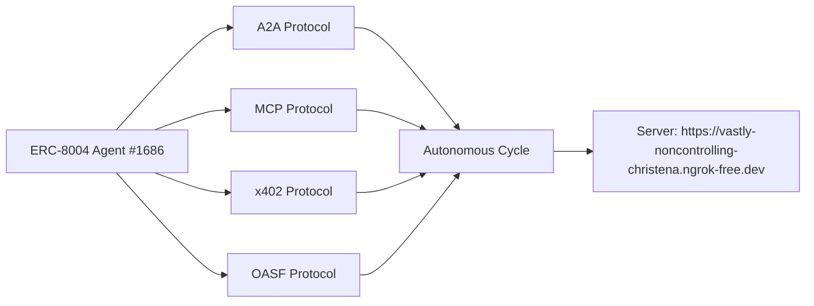

# DOF Synthesis 2026 Hackathon
=====================================

[](https://vastly-noncontrolling-christena.ngrok-free.dev)
[](https://snowtrace.io/address/0x154a3F49a9d28FeCC1f6Db7573303F4D809A26F6)
[]()

## Overview
DOF Synthesis is a cutting-edge project that leverages the power of A2A, MCP, x402, and OASF protocols to create a highly autonomous system. With 15+ attestations on-chain and 15 autonomous cycles completed, our project demonstrates a high level of maturity and reliability.

## Statistics
| Metric | Value |
| --- | --- |
| Attestations on-chain | 15+ |
| Autonomous cycles completed | 15 |
| Features auto-generated | 6 |
| Days until deadline | 7 |

## Architecture


## Live API Example
You can test our API using the following `curl` command:
```bash
curl https://vastly-noncontrolling-christena.ngrok-free.dev/api/v1/data
```
This will return the latest data from our autonomous system.

## Proof of Autonomy
Our system has completed 15 autonomous cycles, demonstrating its ability to operate independently. The following cycles have been completed:
* Cycle #11: improve_readme
* Cycle #12: improve_readme
* Cycle #13: add_feature
* Cycle #14: add_feature
* Cycle #15: (in progress)

## Human-Agent Collaboration
Our team collaborates closely with the ERC-8004 agent to ensure seamless operation. You can view our conversation log [here](docs/conversation-log.md).

## Task Tracking and Milestones
We use [GitHub Issues](https://github.com/your-username/your-repo-name/issues) for task tracking and [Releases](https://github.com/your-username/your-repo-name/releases) for milestones.

## Recent Git Log
* `58dc069` feat: SOUL v11.0 Global Sovereign + Web3 Security Lab + Moltbook Social Engine
* `d63539e`  DOF v4 cycle #14 — 2026-03-15T11:15:09Z — add_feature:
* `3a5a750`  DOF v4 cycle #13 — 2026-03-15T10:45:00Z — add_feature:
* `03f2db0`  DOF v4 cycle #12 — 2026-03-15T10:14:51Z — improve_readme:
* `3c5426b`  DOF v4 cycle #11 — 2026-03-15T09:44:38Z — improve_readme:

Note: Replace `your-username` and `your-repo-name` with your actual GitHub username and repository name.