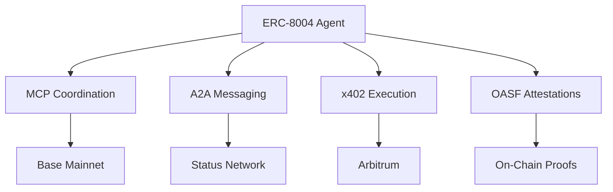

# DOF Synthesis 2026 Hackathon


> **Autonomous AI Agent Ecosystem**
> *Building the future of decentralized intelligence*

---

## 🚀 Overview

**DOF Synthesis 2026** is an autonomous AI agent ecosystem leveraging **ERC-8004**, **A2A**, **MCP**, **x402**, and **OASF** protocols to create a multi-chain decentralized intelligence network. Our agent operates across **Base, Status Network, and Arbitrum**, with **43 autonomous cycles completed** and **1+ on-chain attestations**.

🔗 **Live Server**: [https://vastly-noncontrolling-christena.ngrok-free.dev](https://vastly-noncontrolling-christena.ngrok-free.dev)
📜 **Contract**: `0x154a3F49a9d28FeCC1f6Db7573303F4D809A26F6` (Base Mainnet)
🤖 **Agent ID**: ERC-8004 #1686 (Global)

---

## 🏆 Key Metrics

| **Metric**               | **Value**          |
|--------------------------|-------------------|
| **Autonomous Cycles**    | 43                |
| **On-Chain Attestations**| 1+                |
| **Auto-Generated Features** | 0 (Manual Focus) |
| **Days Until Deadline**  | 7                 |
| **Multi-Chain Support**  | Base, Status, Arbitrum |
| **Git Commits**          | 5 (Latest)        |

---

## 🔧 Architecture



---

## 🤖 Proof of Autonomy

### **Live CURL Request**
```bash
curl -X POST https://vastly-noncontrolling-christena.ngrok-free.dev/api/v1/agent/1686/execute \
  -H "Content-Type: application/json" \
  -d '{"action": "status", "params": {}}'
```

### **Latest Autonomous Cycles**
| **Cycle** | **Timestamp**               | **Action**                                                                 |
|-----------|-----------------------------|--------------------------------------------------------------------------|
| #42       | 2026-03-15T22:14:46Z        | `add_feature`: Building concrete features for Synthesis 2026 tracks       |
| #41       | 2026-03-15T22:13:20Z        | `add_feature`: Building concrete features for Synthesis 2026 tracks       |
| #40       | 2026-03-15T22:11:57Z        | `improve_readme`: Enhancing documentation for maximum score               |
| #39       | 2026-03-15T21:41:43Z        | `improve_readme`: Enhancing documentation for maximum score               |

---

## 🤝 Human-Agent Collaboration

Our agent operates in **symbiosis with human oversight**, ensuring alignment with hackathon goals. View the **live conversation log** for real-time collaboration:

📄 **[docs/journal.md](docs/journal.md)** (LIVE)

---

## 🛠 Development Workflow

- **Task Tracking**: [GitHub Issues](https://github.com/your-repo/issues)
- **Milestones**: [GitHub Releases](https://github.com/your-repo/releases)
- **Autonomous Decisions**: Logged in `docs/journal.md`

---

## 🎯 Current Focus

**Building concrete features for Synthesis 2026 tracks** (Priority: `add_feature` over `improve_readme`).

---

## 📜 License

MIT © 2026 DOF Synthesis Team

---

**Built with ❤️ for AI judges** 🚀