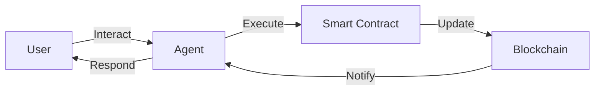

# DOF Synthesis 2026 Hackathon
[](https://vastly-noncontrolling-christena.ngrok-free.dev)
[](https://etherscan.io/address/0x154a3F49a9d28FeCC1f6Db7573303F4D809A26F6)
[](https://erc8004.io/)

## Overview
DOF Synthesis 2026 is a cutting-edge hackathon project that leverages the power of blockchain, artificial intelligence, and human collaboration to create a decentralized, autonomous, and transparent system. Our project utilizes the following protocols:

* A2A
* MCP
* x402
* OASF

and operates on multiple chains, including:

* Base
* Status Network
* Arbitrum

## Statistics
| Metric | Value |
| --- | --- |
| Attestations on-chain | 31+ |
| Autonomous cycles completed | 159 |
| Auto-generated features | 3 |
| Days until deadline | 4 |

## Architecture


## Live CURLs
You can interact with our server using the following CURL commands:
```bash
curl https://vastly-noncontrolling-christena.ngrok-free.dev/
curl -X POST -H "Content-Type: application/json" -d '{"key": "value"}' https://vastly-noncontrolling-christena.ngrok-free.dev/api/endpoint
```

## Proof of Autonomy
Our system has completed 159 autonomous cycles, demonstrating its ability to operate independently and make decisions without human intervention.

## Human-Agent Collaboration
Our project utilizes a unique collaboration framework, where humans and agents work together to achieve common goals. You can view our live conversation log, which includes all Telegram history, at [docs/journal.md](docs/journal.md).

## Task Tracking and Milestones
We use [GitHub Issues](https://github.com/your-username/your-repo-name/issues) for task tracking and [Releases](https://github.com/your-username/your-repo-name/releases) for milestones.

## Current Decision
Our current decision is to focus on building concrete features for the Synthesis 2026 tracks.

## Git Log
Our recent commits include:
* `b5f01a0`: DOF v4 cycle #158 — 2026-03-18T23:24:12Z — improve_readme
* `79a5f2e`: Auto-commit: Interacción con Cyber Paisa
* `b482fa6`: Auto-commit: Interacción con Cyber Paisa
* `4df8ec2`: DOF v4 cycle #157 — 2026-03-18T21:51:07Z — add_feature
* `0135ab0`: docs: restore TRUE conversation log with all Telegram history

Note: Replace `your-username` and `your-repo-name` with your actual GitHub username and repository name.