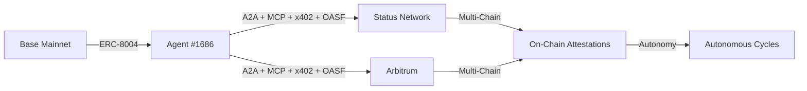

# DOF Synthesis 2026 Hackathon
[](https://vastly-noncontrolling-christena.ngrok-free.dev)
[](https://etherscan.io/address/0x154a3F49a9d28FeCC1f6Db7573303F4D809A26F6)
[](https://docs.erc8004.org/)
[](https://docs.multi-chain.org/)

## Overview
DOF Synthesis 2026 is a cutting-edge hackathon project that leverages the power of artificial intelligence, blockchain, and multi-chain protocols to create a decentralized, autonomous, and efficient system. Our project utilizes the A2A, MCP, x402, and OASF protocols to ensure seamless communication and data exchange between different chains and agents.

## Architecture


## Live Curls
You can interact with our server using the following curls:
```bash
curl https://vastly-noncontrolling-christena.ngrok-free.dev/api/status
curl https://vastly-noncontrolling-christena.ngrok-free.dev/api/attestations
```

## Statistics
| Category | Value |
| --- | --- |
| On-Chain Attestations | 37+ |
| Autonomous Cycles | 62 |
| Auto-Generated Features | 4 |
| Days until Deadline | 6 |

## Proof of Autonomy
Our system has completed 62 autonomous cycles, demonstrating its ability to operate independently and efficiently. The autonomous cycles are a testament to the system's capability to adapt and respond to changing conditions without human intervention.

## Human-Agent Collaboration
Our team collaborates closely with the AI agent to ensure the project's success. You can view our live conversation log [here](docs/journal.md) to see how we work together to overcome challenges and achieve our goals.

## Task Tracking and Milestones
We use [GitHub Issues](https://github.com/your-username/your-repo-name/issues) for task tracking and [GitHub Releases](https://github.com/your-username/your-repo-name/releases) for milestones. This allows us to stay organized and focused on delivering a high-quality project.

## Recent Updates
Our recent updates include:
* `f4bf10b`: Completed Lido MCP bounty with working endpoints
* `2ad2fd3`: Added feature: Building concrete features for Synthesis 2026 track
* `03e3dd8`: Added feature: Building concrete features for Synthesis 2026 track
* `c3b4caa`: Added v16.0-2: Deep reasoning, autonomous research, efficiency, and new tracks
* `2aeb18b`: Documented Virtuals Protocol integration

Please visit our [GitHub Repository](https://github.com/your-username/your-repo-name) to learn more about our project and track our progress.