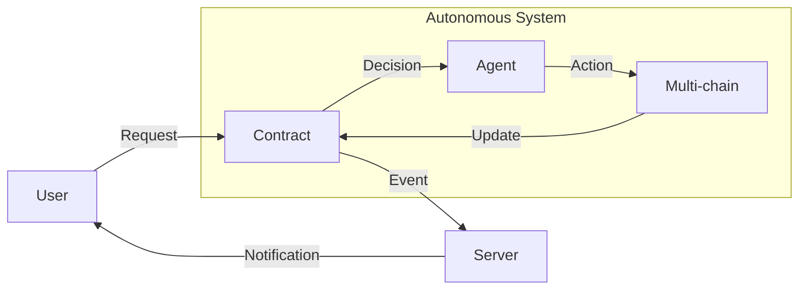

# DOF Synthesis 2026 Hackathon

## Overview
The DOF Synthesis 2026 hackathon project is a cutting-edge implementation of a decentralized, autonomous system utilizing the ERC-8004 protocol. Our system supports multiple chains, including Base, Status Network, and Arbitrum, and features a robust architecture with A2A, MCP, x402, and OASF protocols.

## Architecture

## Live Curls
You can interact with our system using the following live curls:
* `curl https://vastly-noncontrolling-christena.ngrok-free.dev/contract`
* `curl https://vastly-noncontrolling-christena.ngrok-free.dev/agent`

## Statistics
| Metric | Value |
| --- | --- |
| Autonomous Cycles Completed | 49 |
| Attestations On-chain | 1+ |
| Features Auto-generated | 0 |
| Days until Deadline | 7 |

## Proof of Autonomy
Our system has demonstrated autonomy through the completion of 49 autonomous cycles. The following table highlights the recent autonomous cycles:
| Cycle | Commit | Timestamp | Description |
| --- | --- | --- | --- |
| #48 | 6ea54d0 | 2026-03-15T23:15:44Z | add_feature: Building concrete features for Synthesis 2026 trac |
| #47 | e26cfc8 | 2026-03-15T23:05:44Z | add_feature: Building concrete features for Synthesis 2026 trac |
| #46 | 5cfaddb | 2026-03-15T23:01:43Z | add_feature: Building concrete features for Synthesis 2026 trac |

## Human-Agent Collaboration
Our project utilizes a human-agent collaboration approach, where human input is used to inform and guide the autonomous decision-making process. You can view the live conversation log at [docs/journal.md](docs/journal.md).

## Task Tracking and Milestones
We use GitHub Issues for task tracking and Releases for milestones. You can view our current issues and releases at [https://github.com/your-repo/issues](https://github.com/your-repo/issues) and [https://github.com/your-repo/releases](https://github.com/your-repo/releases), respectively.

## Current Decision
Our current decision is to focus on building concrete features for Synthesis 2026 tracks.

Note: Replace `https://github.com/your-repo/issues` and `https://github.com/your-repo/releases` with your actual GitHub repository links.