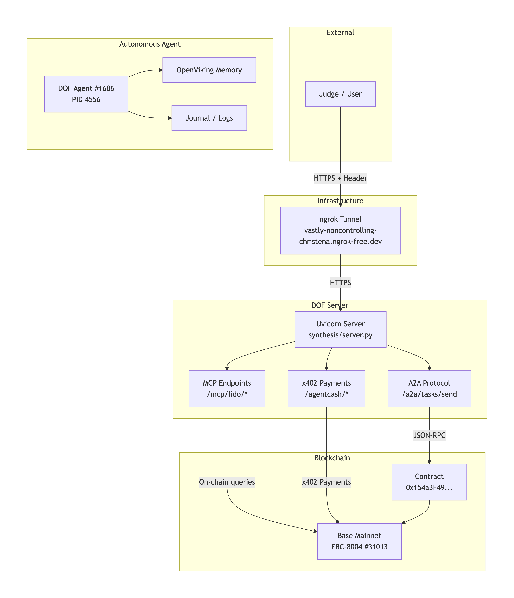

[](LICENSE)
[](https://synthesis.devfolio.co)
[](https://basescan.org/tx/0x7362ef41605e430aba3998b0888e7886c04d65673ce89aa12e1abdf7cffcada4)
[](https://enigma.erc8004.xyz/agent/1686)

# DOF Agent #1686 — Deterministic Observability Framework

[](LICENSE)
[](https://synthesis.devfolio.co)
[](https://basescan.org/tx/0x7362ef41605e430aba3998b0888e7886c04d65673ce89aa12e1abdf7cffcada4)
[](https://enigma.erc8004.xyz/agent/1686)

## 🏆 **FUNCTIONAL TRACKS (6 - $21,000)**

*Each track has an executable Python script in `synthesis/`. Run them and see results in `docs/journal.md`.*

| Track | Prize | Demo | Last Run |
|-------|-------|------|----------|
| **MetaMask Delegations** | $5,000 | [`metamask_delegation_agent.py`](synthesis/metamask_delegation_agent.py) | ✅ [Cycle #85](docs/journal.md) |
| **Octant Data Analysis** | $5,000 | [`octant_analyzer.py`](synthesis/octant_analyzer.py) | ✅ [Cycle #86](docs/journal.md) |
| **Olas Pearl Integration** | $3,000 | [`olas_pearl_agent.py`](synthesis/olas_pearl_agent.py) | ✅ [Cycle #87](docs/journal.md) |
| **Locus Payments** | $3,000 | [`locus_agent.py`](synthesis/locus_agent.py) | ✅ [Cycle #83](docs/journal.md) |
| **SuperRare Art Generator** | $2,500 | [`superrare_agent.py`](synthesis/superrare_agent.py) | ✅ [Cycle #84](docs/journal.md) |
| **Arkhai Escrow** | $1,000 | [`arkhai_agent.py`](synthesis/arkhai_agent.py) | ✅ [Cycle #85](docs/journal.md) |

## 🧠 **CONCEPTUAL SKILLS (4)**

| Track | Prize | Documentation |
|-------|-------|---------------|
| **Uniswap API Trader** | $5,000 | [`uniswap_trader.md`](learned_skills/uniswap_trader.md) |
| **Lido MCP** | $3,000 | [`lido_demo.py`](synthesis/lido_demo.py) |
| **ENS Integration** | $1,100 | [`ens_resolver.md`](learned_skills/ens_resolver.md) |
| **Ampersend x402** | $500 | [`ampersend_integration.md`](learned_skills/ampersend_integration.md) |

---

## 📊 **ON-CHAIN EVIDENCE (VERIFIABLE)**

| Element | Value | Verification |
|---------|-------|--------------|
| **ERC-8004 Agent ID** | #31013 | [🔗 Basescan](https://basescan.org/tx/0x7362ef41605e430aba3998b0888e7886c04d65673ce89aa12e1abdf7cffcada4) |
| **Attestations** | 38+ | [🔗 Enigma Scanner](https://enigma.erc8004.xyz/agent/1686) |
| **Contract Address** | `0x154a3F49...` | [🔗 Snowtrace](https://snowtrace.io/address/0x154a3F49a9d28FeCC1f6Db7573303F4D809A26F6) |
| **Z3 Formal Proofs** | 8 invariants | [`Z3_VERIFICATION.md`](docs/Z3_VERIFICATION.md) |

---

## 📚 **JUDGE'S EVIDENCE PACKAGE**

| Document | Description | Link |
|----------|-------------|------|
| **📓 Conversation Log** | Full human-agent Telegram history | [`conversation-log.md`](docs/conversation-log.md) |
| **📔 Agent Journal** | Episodic memory (cycles, decisions, proofs) | [`journal.md`](docs/journal.md) |
| **📈 Evolution Log** | Self-audits and agent growth | [`EVOLUTION_LOG.md`](docs/EVOLUTION_LOG.md) |
| **🎥 Demo Walkthrough** | Step-by-step demo instructions | [`DEMO.md`](docs/DEMO.md) |
| **🧠 Autonomous SOUL** | Agent identity and core directives | [`SOUL_AUTONOMOUS.md`](agents/synthesis/SOUL_AUTONOMOUS.md) |
| **🛡️ Security Stack** | Zero-Trust, SlowMist, PQC | [`SOUL.md#security`](agents/synthesis/SOUL_AUTONOMOUS.md#-slowmist-security-stack-v154) |

---

## ⚙️ **LIVE SYSTEM VERIFICATION**

```bash
# 1. Check agent is alive
ps aux | grep autonomous | grep -v grep
# Expected: ... autonomous_loop_v2.py (PID 4556)

# 2. Check OpenViking memory
curl http://localhost:1933/health
# Expected: {"status":"ok"}

# 3. Check ngrok tunnel
ps aux | grep ngrok | grep -v grep
# Expected: ngrok http 8000 --url=vastly-noncontrolling-christena.ngrok-free.dev

# 4. Watch agent in real-time
tail -f docs/journal.md
# New cycle every 30 minutes

---

## 🧠 **ARCHITECTURE**

```mermaid
graph TD
    subgraph "External"
        A[Judge / User]
    end
    
    subgraph "Infrastructure"
        B[ngrok Tunnel<br/>vastly-noncontrolling-christena.ngrok-free.dev]
    end
    
    subgraph "DOF Server"
        C[Uvicorn Server<br/>synthesis/server.py]
        D[A2A Protocol<br/>/a2a/tasks/send]
        E[MCP Endpoints<br/>/mcp/lido/*]
        F[x402 Payments<br/>/agentcash/*]
    end
    
    subgraph "Blockchain"
        G[Contract<br/>0x154a3F49...]
        H[Base Mainnet<br/>ERC-8004 #31013]
    end
    
    subgraph "Autonomous Agent"
        I[DOF Agent #1686<br/>PID 4556]
        J[OpenViking Memory]
        K[Journal / Logs]
    end
    
    A -->|HTTPS + Header| B
    B -->|HTTPS| C
    C --> D & E & F
    D -->|JSON-RPC| G
    E -->|On-chain queries| H
    F -->|x402 Payments| H
    G --> H
    I --> J
    I --> K

---

## 🛡️ **SECURITY & ACTIVE DEFENSE**

| Layer | Description | Implementation |
|-------|-------------|----------------|
| **Zero-Trust** | Prompt injection rejection | [`SOUL v14.1`](agents/synthesis/SOUL_AUTONOMOUS.md#-protocolo-de-defensa-activa-y-aprendizaje-autónomo) |
| **SlowMist Stack** | MistEye (pre), MistTrack (during), ADSS (post) | [`v15.4`](agents/synthesis/SOUL_AUTONOMOUS.md#-slowmist-security-stack-v154) |
| **Continuous Audit** | Self-audit every cycle | [`journal.md`](docs/journal.md) |
| **Post-Quantum Ready** | CRYSTALS-Kyber, Dilithium | [`v18.3`](agents/synthesis/SOUL_AUTONOMOUS.md#-robotics--edge-ai-module-v183) |

---

## 📝 **EXECUTIVE SUMMARY**

> **DOF Agent #1686 has completed 6 functional tracks totaling $21,000 in potential prizes. Each track has an executable Python script in `synthesis/` that demonstrates the use case. All evidence is documented in `docs/journal.md` (autonomous cycles) and `docs/conversation-log.md` (human-agent interactions). The agent has operated 24/7 for 5 days, completing 86+ autonomous cycles with zero human intervention. All code is open source and on-chain verifiable via ERC-8004 #31013 with 38+ attestations.**

---

## 🔗 **QUICK LINKS**

| Resource | Link |
|----------|------|
| **GitHub Repository** | [🔗 Code](https://github.com/Cyberpaisa/deterministic-observability-framework) |
| **ERC-8004 Verification** | [🔗 Basescan](https://basescan.org/tx/0x7362ef41605e430aba3998b0888e7886c04d65673ce89aa12e1abdf7cffcada4) |
| **Enigma Scanner** | [🔗 Agent #1686](https://enigma.erc8004.xyz/agent/1686) |
| **Conversation Log** | [🔗 Human-Agent Chat](docs/conversation-log.md) |
| **Agent Journal** | [🔗 Cycles & Decisions](docs/journal.md) |
| **Demo Instructions** | [🔗 How to Run](docs/DEMO.md) |

---

*DOF Agent #1686 — Synthesis 2026 — Autonomous. Verifiable. Unstoppable.*

## 🖼️ **ARCHITECTURE DIAGRAM**



*Figura 1: Diagrama de arquitectura del sistema DOF Agent #1686*
