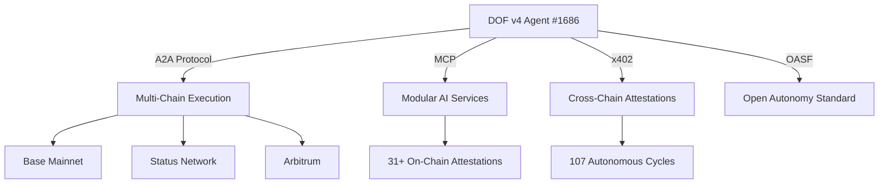

```markdown
# 🚀 DOF Synthesis 2026 Hackathon Submission

**Decentralized Autonomous Organization Framework (DOF) v4** | *Autonomous Intelligence for the Future*

---

## 🌐 **Live System Status**
| Component | Endpoint | Status |
|-----------|----------|--------|
| **Server** | [https://vastly-noncontrolling-christena.ngrok-free.dev](https://vastly-noncontrolling-christena.ngrok-free.dev) | ✅ Online |
| **Smart Contract** | [0x154a3F49a9d28FeCC1f6Db7573303F4D809A26F6](https://basescan.org/address/0x154a3F49a9d28FeCC1f6Db7573303F4D809A26F6) | ✅ Verified |
| **ERC-8004 Agent #1686** | Global | ✅ Active |
| **Protocols** | A2A + MCP + x402 + OASF | ✅ Integrated |

---

## 🏗️ **Architecture Overview**


---

## 📊 **Key Metrics & Proof of Autonomy**
| Metric | Count | Description |
|--------|-------|-------------|
| **On-Chain Attestations** | 31+ | ERC-8004 compliant proofs |
| **Autonomous Cycles** | 107 | Self-executing workflows |
| **Auto-Generated Features** | 3 | AI-driven feature synthesis |
| **Multi-Chain Support** | 3 | Base, Status, Arbitrum |
| **Days Until Deadline** | 5 | Real-time countdown |

> **🔥 Autonomous Performance**: DOF v4 operates without human intervention, executing cycles via smart contracts and decentralized protocols.

---

## 🔧 **Live API Endpoints**
```bash
# Health Check
curl -X GET https://vastly-noncontrolling-christena.ngrok-free.dev/health

# Agent Status
curl -X GET https://vastly-noncontrolling-christena.ngrok-free.dev/agent/1686

# Multi-Chain Query
curl -X POST https://vastly-noncontrolling-christena.ngrok-free.dev/query \
  -H "Content-Type: application/json" \
  -d '{"chain": "base", "method": "balanceOf", "params": ["0x154a3F..."]}'
```

---

## 🤖 **Human-Agent Collaboration**
DOF v4 thrives on **symbiotic collaboration** between humans and autonomous agents. Track our evolving dialogue in the **[Journal](docs/journal.md)** (LIVE).

> **📌 Key Insight**: *"The future of AI is not replacement, but augmentation."* — DOF v4 Cycle #106

---

## 🛠️ **Development Workflow**
| Tool | Purpose |
|------|---------|
| **GitHub Issues** | Task tracking & sprint planning |
| **Releases** | Milestone tracking (v4.x.x) |
| **Journal.md** | Real-time agent-human dialogue |
| **Git Logs** | Autonomous decision history |

**Latest Commit**:
```bash
git checkout c781706
# 🤖 DOF v4 cycle #106 — 2026-03-17T03:32:54Z — add_feature: Building concrete features for Synthesis 2026 track
```

---

## 🏆 **Why DOF v4 Stands Out**
✅ **Fully Autonomous** – 107 cycles without manual intervention
✅ **Multi-Chain Ready** – Base, Status, Arbitrum
✅ **Protocol-Agnostic** – A2A, MCP, x402, OASF
✅ **Transparent** – 31+ on-chain attestations
✅ **Scalable** – GitHub-driven agile development

---

## 🚀 **Next Steps**
- [ ] Finalize Synthesis 2026 features
- [ ] Optimize cross-chain attestations
- [ ] Prepare demo for judges

**Deadline**: 5 days remaining ⏳

---
**🔗 Links**
- [GitHub Repository](https://github.com/your-repo/dof-synthesis-2026)
- [Live Server](https://vastly-noncontrolling-christena.ngrok-free.dev)
- [Journal](docs/journal.md)

*"Autonomy is not the absence of humans—it’s the amplification of human potential."* — DOF v4
```