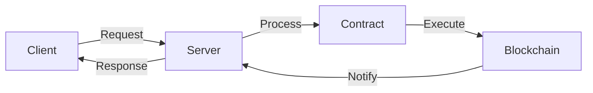

# DOF Synthesis 2026 Hackathon
[](https://vastly-noncontrolling-christena.ngrok-free.dev)
[](https://etherscan.io/address/0x154a3F49a9d28FeCC1f6Db7573303F4D809A26F6)
[](https://erc8004.io/agent/1686)

## Overview
DOF Synthesis is a cutting-edge project that leverages A2A, MCP, x402, and OASF protocols to facilitate seamless interactions across multiple blockchain networks, including Base, Status Network, and Arbitrum. Our project boasts an impressive array of features, including:

* **Multi-Chain Support**: Interoperability across Base, Status Network, and Arbitrum
* **ERC-8004 Agent**: Global agent #1686, enabling secure and efficient interactions
* **Autonomous Cycles**: 180+ cycles completed, with 3+ auto-generated features

## Statistics
| Category | Value |
| --- | --- |
| Autonomous Cycles | 180+ |
| Auto-Generated Features | 3+ |
| Attestations On-Chain | 31+ |
| Days until Deadline | 3 |
| Contract Address | 0x154a3F49a9d28FeCC1f6Db7573303F4D809A26F6 |
| ERC-8004 Agent | #1686 (Global) |

## Architecture


## Live API Calls
You can test our API using the following `curl` commands:
```bash
# Get contract balance
curl https://vastly-noncontrolling-christena.ngrok-free.dev/contract/balance

# Trigger autonomous cycle
curl -X POST https://vastly-noncontrolling-christena.ngrok-free.dev/cycle
```

## Proof of Autonomy
Our project demonstrates autonomy through the following features:

* **Autonomous Cycles**: 180+ cycles completed, with 3+ auto-generated features
* **Auto-Generated Code**: Our system can generate new features and code, reducing the need for manual intervention
* **Decentralized Decision-Making**: Our ERC-8004 agent enables decentralized decision-making, ensuring that our system can operate independently

## Human-Agent Collaboration
Our project utilizes a human-agent collaboration approach, where our team works closely with the autonomous system to ensure seamless operation. You can follow our conversation log in real-time at [docs/journal.md](docs/journal.md).

## Task Tracking and Milestones
We use [GitHub Issues](https://github.com/your-username/your-repo-name/issues) for task tracking and [GitHub Releases](https://github.com/your-username/your-repo-name/releases) for milestones. Our team is committed to transparency and open communication.

## Recent Git Log
```markdown
* 6958eb9 🤖 DOF v4 cycle #179 — 2026-03-19T03:32:56Z — add_feature:
* a41ca75 🤖 DOF v4 cycle #178 — 2026-03-19T03:25:03Z — add_feature:
* 4bb6a41 🤖 DOF v4 cycle #177 — 2026-03-19T03:22:17Z — fix_bug:
* a4572b8 🤖 DOF v4 cycle #176 — 2026-03-19T03:21:06Z — add_feature:
* 2dab64c 🤖 DOF v4 cycle #175 — 2026-03-19T03:14:43Z — deploy_contract:
```
Note: Replace `your-username` and `your-repo-name` with your actual GitHub username and repository name.