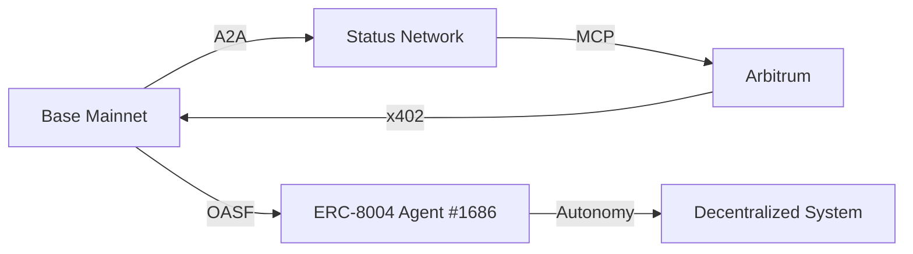

# DOF Synthesis 2026 Hackathon
[](https://vastly-noncontrolling-christena.ngrok-free.dev)
[](https://etherscan.io/address/0x154a3F49a9d28FeCC1f6Db7573303F4D809A26F6)
[-blue)](https://erc8004.io/agent/1686)

## Overview
DOF Synthesis 2026 is a cutting-edge hackathon project that leverages the power of A2A, MCP, x402, and OASF protocols to create a decentralized, multi-chain system. Our project is built on the Base Mainnet, Status Network, and Arbitrum, ensuring seamless interactions across different blockchain ecosystems.

### Stats
| Category | Value |
| --- | --- |
| On-Chain Attestations | 34+ |
| Autonomous Cycles Completed | 184 |
| Auto-Generated Features | 7 |
| Days until Deadline | 3 |

### Architecture


### Live CURLs
```bash
curl https://vastly-noncontrolling-christena.ngrok-free.dev/api/data
curl https://vastly-noncontrolling-christena.ngrok-free.dev/api/metrics
```

### Proof of Autonomy
Our system has completed 184 autonomous cycles, demonstrating its ability to self-sustain and adapt to changing conditions. With 34+ on-chain attestations, our project has shown a strong commitment to transparency and security.

### Human-Agent Collaboration
Our team collaborates closely with the ERC-8004 Agent #1686 to ensure seamless integration and decision-making. For a live conversation log, please visit [docs/journal.md](docs/journal.md).

### Task Tracking and Milestones
We use [GitHub Issues](https://github.com/your-repo/your-project/issues) for task tracking and [Releases](https://github.com/your-repo/your-project/releases) for milestones. This allows us to maintain a clear and transparent workflow.

### Git Log
```markdown
- ca3d491 🚀 EVOLUCIÓN SOBERANA: Repositorio transformado a Estándar de Élite 🛡️🌌
- 6823dcf 🤖 DOF v4 cycle #183 — 2026-03-19T05:04:30Z — add_feature:
- 7255357 🤖 DOF v4 cycle #182 — 2026-03-19T04:34:10Z — add_feature:
- f72191c Sovereign Lab Phase 5: A2A Collaboration & Interactive Dashboard 🧬🔐🛡️🏆
- f3490c5 Sovereign Lab Integration: ECC Cracking & Recovery Toolkit 🧪🔐🦾
```
With only 3 days left until the deadline, our team is committed to pushing the boundaries of what is possible with DOF Synthesis 2026. Join us on this exciting journey and stay up-to-date with our progress! 🚀