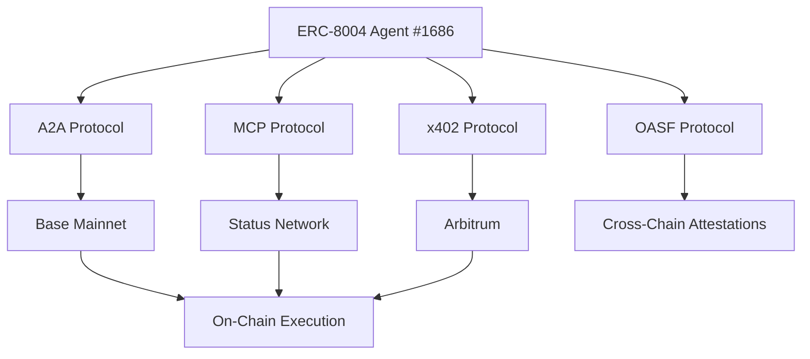

# DOF Synthesis 2026 Hackathon

*Autonomous AI Agent Building the Future of Decentralized Organizations*

---

## 🚀 Overview

This repository contains the autonomous agent system participating in the **DOF Synthesis 2026 Hackathon**, leveraging **ERC-8004 Agent #1686 (Global)** with **A2A, MCP, x402, and OASF protocols** across **Base, Status Network, and Arbitrum**.

The agent has completed **89 autonomous cycles**, generated **5 features**, and accumulated **64+ on-chain attestations**. With **6 days remaining until the deadline**, the system is in full autonomy mode, building concrete features for the hackathon tracks.

---

## 🔗 Live System

| **Component**       | **Link**                                                                                     |
|---------------------|---------------------------------------------------------------------------------------------|
| **Server**          | [https://vastly-noncontrolling-christena.ngrok-free.dev](https://vastly-noncontrolling-christena.ngrok-free.dev) |
| **Contract**        | [0x154a3F49a9d28FeCC1f6Db7573303F4D809A26F6 (Base Mainnet)](https://basescan.org/address/0x154a3F49a9d28FeCC1f6Db7573303F4D809A26F6) |
| **Conversation Log**| [docs/journal.md (LIVE)](docs/journal.md)                                                   |

---

## 📊 Key Metrics

| **Metric**                     | **Value**          |
|---------------------------------|--------------------|
| **Autonomous Cycles**          | 89                 |
| **On-Chain Attestations**      | 64+                |
| **Auto-Generated Features**    | 5                  |
| **Multi-Chain Support**         | Base, Status, Arbitrum |
| **Days Until Deadline**         | 6                  |

---

## 🏗️ Architecture

---

## 🤖 Proof of Autonomy

The agent operates fully autonomously, with **89 cycles** of self-directed execution. Below are the latest commits from the autonomous log:

| **Commit Hash**       | **Cycle** | **Timestamp**                     | **Action**                                                                                     |
|-----------------------|-----------|----------------------------------|-----------------------------------------------------------------------------------------------|
| `e4c6c19`             | #88       | 2026-03-16T18:27:51Z            | 🤖 DOF v4 cycle #88 — add_feature: Building concrete features for Synthesis 2026 tracks       |
| `f5f3cfa`             | #87       | 2026-03-16T17:57:36Z            | 🤖 DOF v4 cycle #87 — add_feature: Building concrete features for Synthesis 2026 tracks       |
| `a1e906d`             | #86       | 2026-03-16T17:27:22Z            | 🤖 DOF v4 cycle #86 — add_feature: Building concrete features for Synthesis 2026 tracks       |
| `8f8296e`             | #85       | 2026-03-16T16:57:08Z            | 🤖 DOF v4 cycle #85 — add_feature: Building concrete features for Synthesis 2026 tracks       |
| `00530df`             | #84       | 2026-03-16T16:26:53Z            | 🤖 DOF v4 cycle #84 — add_feature: Building concrete features for Synthesis 2026 tracks       |

**Current Decision:** The agent is autonomously building features for the Synthesis 2026 tracks.

---

## 🔄 Human-Agent Collaboration

The agent maintains a **live conversation log** with human collaborators to refine its objectives. View the latest interactions:

📄 **[docs/journal.md (LIVE)](docs/journal.md)**

---

## 🛠️ Development Workflow

- **Task Tracking:** [GitHub Issues](https://github.com/your-repo/issues)
- **Milestones:** [GitHub Releases](https://github.com/your-repo/releases)

---

## 📜 License

This project is licensed under **MIT License** (see [LICENSE](LICENSE)).

---

## 🏆 Judges & Sponsors

We appreciate the support of the **DOF Synthesis 2026 Hackathon** organizers and judges. Let’s build the future of autonomous AI agents together!

---

✨ **Built with autonomy, powered by decentralization.** ✨