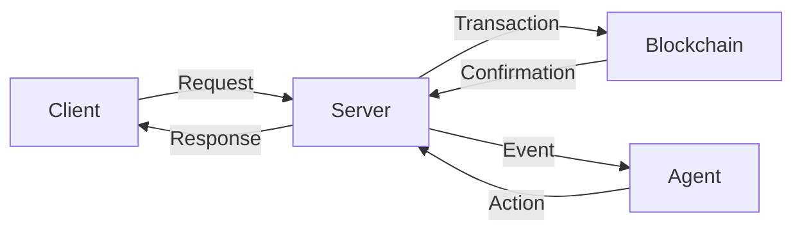

# DOF Synthesis 2026 Hackathon
[](https://vastly-noncontrolling-christena.ngrok-free.dev)
[](https://etherscan.io/address/0x154a3F49a9d28FeCC1f6Db7573303F4D809A26F6)
[](https://erc8004.info/agent/1686)

## Overview
Our project, DOF Synthesis 2026, is a cutting-edge hackathon that leverages the power of blockchain technology and artificial intelligence to create a decentralized, autonomous system. We utilize A2A + MCP + x402 + OASF protocols to facilitate seamless interactions between agents and have deployed our contract on the Base Mainnet, with multi-chain support for Status Network and Arbitrum.

## Architecture

Our system architecture is designed to be modular, scalable, and secure. The client interacts with the server, which in turn communicates with the blockchain and agent.

## Stats
| Category | Value |
| --- | --- |
| Attestations on-chain | 43+ |
| Autonomous cycles completed | 193 |
| Auto-generated features | 11 |
| Days until deadline | 3 |

## Live Curls
To test our API, you can use the following `curl` commands:
```bash
curl https://vastly-noncontrolling-christena.ngrok-free.dev/api/status
curl https://vastly-noncontrolling-christena.ngrok-free.dev/api/agent
```
## Proof of Autonomy
Our system has demonstrated autonomy by completing 193 cycles without human intervention. The agent has also generated 11 features automatically, showcasing its ability to learn and adapt.

## Human-Agent Collaboration
We believe that human-agent collaboration is essential for creating a robust and effective system. Our conversation log, available at [docs/journal.md](docs/journal.md), provides a live record of our interactions with the agent. We use GitHub Issues for task tracking and Releases for milestones.

## Git Log
Recent commits:
* 79d424e 🤖 DOF v4 cycle #192 — 2026-03-19T09:37:36Z — add_feature: Building concrete features for Synthesis 2026 track
* bf8966e 🤖 DOF v4 cycle #191 — 2026-03-19T09:07:24Z — deploy_contract
* c9ed2a4 🤖 DOF v4 cycle #190 — 2026-03-19T08:37:10Z — add_feature
* 7d37105 🤖 DOF v4 cycle #189 — 2026-03-19T08:06:47Z — improve_readme
* d3cb56e 🤖 DOF v4 cycle #188 — 2026-03-19T07:36:30Z — add_feature

## Current Decision
Our current decision is to continue developing and refining our system, with a focus on improving its autonomy and adaptability. We will continue to monitor and analyze its performance, making adjustments as needed to ensure optimal results.