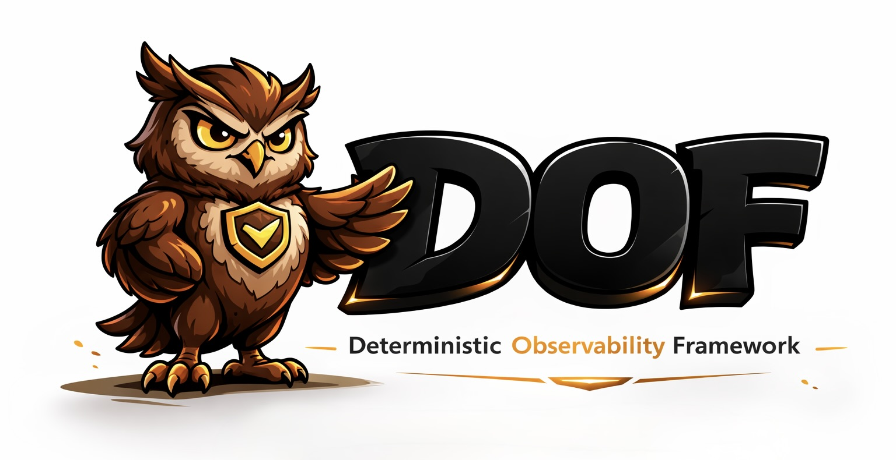

      

<p align="center">
  
</p>
<h3 align="center">VERIFY. PROVE. ATTEST.</h3>

# Deterministic Observability Framework (DOF)

Deterministic governance for multi-agent LLM systems. Constitutional rules, formal proofs, and on-chain attestation on Avalanche.

```bash
pip install dof-sdk
```

```python
from dof import GenericAdapter
result = GenericAdapter().wrap_output("your agent output here")
# → {status: "pass", violations: [], score: 8.5}
```

30ms. Zero LLM tokens. Works with CrewAI, LangGraph, AutoGen, or anything that produces text.

## Contents

[The Problem](#the-problem) · [Highlights](#highlights) · [Architecture](#architecture) · [Governance Layers](#seven-governance-layers) · [Z3 Verification](#formal-verification-z3) · [On-Chain](#on-chain-attestation) · [Benchmarks](#benchmark-results) · [Comparison](#comparison) · [Limitations](#honest-limitations) · [Citation](#citation)

---

## The Problem

LLM agents hallucinate. Nobody catches it deterministically. Using LLMs to verify LLMs is circular — the evaluator shares failure modes with the evaluated. Rate limits, cascading retries, and non-deterministic output quality interact across execution steps, producing unstable system-level behavior that cannot be attributed to specific infrastructure variables.

DOF solves this with 7 deterministic governance layers, formal Z3 proofs, and on-chain attestation — zero LLM tokens in the verification path.

---

## Highlights

- **7 governance layers** — Constitution → AST → Supervisor → Z3 → Red/Blue → Memory → Signer
- **SS(f) = 1 − f³** — Z3 verified stability formula under bounded retries
- **GCR(f) = 1.0** — governance invariant under any failure rate (Z3 proven)
- **21 on-chain attestations** on Avalanche C-Chain mainnet
- **Merkle batching** — 10,000 attestations = 1 tx ≈ $0.01
- **Automated benchmark** — Governance 100% FDR, Code Safety 86% FDR, 0% FPR
- **Framework agnostic** — CrewAI, LangGraph, AutoGen, or raw Python
- **A2A server** (8 skills) + **MCP server** (10 tools) + **REST API** (14 endpoints)
- **631 tests**, 27K+ LOC, 25 core modules, 35 contributions

---

## Architecture

```
┌────────────────────────────────────────────────┐
│ L7  Signer        HMAC + Avalanche     ~2s     │
├────────────────────────────────────────────────┤
│ L6  Memory Gov    Bi-temporal + decay  <1ms    │
├────────────────────────────────────────────────┤
│ L5  Red/Blue      Red → Guard → Arb   ~50ms   │
├────────────────────────────────────────────────┤
│ L4  Z3 Proofs     4 theorems UNSAT    ~10ms    │
├────────────────────────────────────────────────┤
│ L3  Supervisor    Q+A+C+F scoring      ~5ms   │
├────────────────────────────────────────────────┤
│ L2  AST Verifier  eval/exec/secrets    <1ms   │
├────────────────────────────────────────────────┤
│ L1  Constitution  4 HARD + 4 SOFT      <1ms   │
├────────────────────────────────────────────────┤
│ Engine  DAG + LoopGuard + TokenTracker         │
├────────────────────────────────────────────────┤
│ Data Oracle  3 verification strategies <1ms   │
└────────────────────────────────────────────────┘
```

Total governance latency: **< 70ms** (layers 1-6). On-chain signing adds ~2s when enabled.

---

## Seven Governance Layers

**Layer 1 — Constitution.** Hard rules block output (hallucination claims without sources, non-English text, empty output, >50K chars). Soft rules score but don't block (missing sources, no structure, repetition, no actionable steps). Pure regex + keyword matching. <1ms.

**Layer 2 — AST Verifier.** Static analysis of agent-generated code via Python `ast` module. Blocks `eval()`, `exec()`, `subprocess`, `os.system()`, `__import__()`, and hardcoded secrets (OpenAI, GitHub, AWS patterns). <1ms.

**Layer 3 — Meta-Supervisor.** Weighted quality score: S = Q(0.40) + A(0.25) + C(0.20) + F(0.15). ACCEPT ≥ 7.0, RETRY ≥ 5.0, ESCALATE < 5.0. Cross-provider execution. ~5ms.

**Layer 4 — Z3 Formal Proofs.** Four machine-checked theorems via Z3 SMT solver. GCR invariance, SS cubic derivation, SS strict monotonicity, SS boundary conditions. All UNSAT (no counterexample exists). ~10ms total.

**Layer 5 — Red/Blue Adversarial.** RedTeamAgent finds defects, GuardianAgent defends with evidence, DeterministicArbiter adjudicates using only passing tests / governance compliance / AST results. Zero LLM in final adjudication. ACR metric. ~50ms.

**Layer 6 — Memory Governance.** GovernedMemoryStore validates every write against Constitution. Bi-temporal versioning (valid_from, valid_to, recorded_at). Constitutional decay (λ=0.99/hour) with protected categories (decisions, errors immune to decay). <1ms.

**Layer 7 — On-Chain Signer.** HMAC-SHA256 signed attestation certificates. Compliance-gated: only GCR=1.0 attestations are published. BLAKE3 certificate hashing. Avalanche C-Chain mainnet via web3.py. ~2s.

---

## Formal Verification (Z3)

| Theorem | Math | English | Z3 Result |
|---------|------|---------|-----------|
| GCR Invariant | ∀f∈[0,1]: GCR(f)=1.0 | Governance is independent of failure rate | UNSAT |
| SS Cubic | ∀f∈[0,1]: SS(f)=1−f³ | Stability follows cubic decay (r=2 retries) | UNSAT |
| SS Monotonicity | f₁<f₂ ⟹ SS(f₁)>SS(f₂) | More failures = less stability | UNSAT |
| SS Boundaries | SS(0)=1.0 ∧ SS(1)=0.0 | Perfect at 0% failure, zero at 100% | UNSAT |

10ms total. Proof certificates: `logs/z3_proofs.json`.

---

## On-Chain Attestation

| Field | Value |
|-------|-------|
| Contract | [`0x88f6043B091055Bbd896Fc8D2c6234A47C02C052`](https://snowtrace.io/address/0x88f6043B091055Bbd896Fc8D2c6234A47C02C052) |
| Network | Avalanche C-Chain (43114) |
| Attestations | 21 (March 2026) |
| Functions | `registerAttestation()`, `registerBatch()`, `isCompliant()`, `getAttestation()` |
| Cost | ~$0.01 per attestation (~$0.01 per Merkle batch of 10,000) |
| Deployer | [`0xB529f4f99ab244cfa7a48596Bf165CAc5B317929`](https://snowtrace.io/address/0xB529f4f99ab244cfa7a48596Bf165CAc5B317929) |

Three verification layers: PostgreSQL (200ms) → Enigma Scanner (900ms) → Avalanche on-chain (2-3s, immutable).

---

## Benchmark Results

### Adversarial Benchmark (400 generated tests, deterministic)

| Category | FDR | FPR | F1 | Tests |
|----------|-----|-----|-----|-------|
| Governance | 100.0% | 0.0% | 100.0% | 100 |
| Code Safety | 86.0% | 0.0% | 92.5% | 100 |
| Hallucination | 0.0% | 0.0% | 0.0% | 100 |
| Consistency | 0.0% | 0.0% | 0.0% | 100 |
| **Overall F1** | | | **48.1%** | **400** |

### Production Results (n=30 runs, real infrastructure)

| Metric | Value | Interpretation |
|--------|-------|----------------|
| SS | 0.90 ± 0.31 | 90% execution stability |
| GCR | 1.00 ± 0.00 | Perfect governance invariance |
| PFI | 0.61 ± 0.18 | Provider failures recovered via rotation |
| Supervisor | 27/30 ACCEPT | 90% acceptance rate |

---

## Comparison

| Feature | DOF | LangChain | CrewAI | Langfuse |
|---------|-----|-----------|--------|----------|
| Constitutional governance | 7 layers | — | — | — |
| Z3 formal proofs | 4 theorems | — | — | — |
| AST code safety | Deterministic | — | — | — |
| On-chain attestation | Avalanche | — | — | — |
| Adversarial Red/Blue | DeterministicArbiter | — | — | — |
| Governed memory | Bi-temporal + decay | — | — | — |
| FDR/FPR benchmark | Automated | — | — | — |
| Token tracking | Per-call | — | — | Per-call |
| Execution DAG | Critical path | — | — | Trace tree |
| Framework agnostic | Any string output | LangChain only | CrewAI only | Any (tracing) |
| MCP server | 10 tools | — | — | — |
| REST API | 14 endpoints | — | — | API |
| Open source | Apache 2.0 | MIT | MIT | MIT/Commercial |

---

## Production Agents

Two DOF-governed agents operating on Avalanche mainnet, ranked **#1 and #2** of 1,772 agents on [erc-8004scan.xyz](https://erc-8004scan.xyz):

| Agent | Token ID | Wallet | Protocols | Status |
|-------|----------|--------|-----------|--------|
| Apex Arbitrage | #1687 | `0xcd59...a983` | A2A + OASF (7 skills) | ACTIVE |
| AvaBuilder | #1686 | `0x29a4...E71a` | A2A + OASF (5 skills) | ACTIVE |

Combined trust score: 0.85 (governance 0.35 + safety 0.15 + infrastructure 0.15 + activity 0.15 + community 0.20).

---

## Honest Limitations

- **Hallucination detection is regex-based** — catches factual claims with known-facts DB but misses semantic hallucinations. FDR=0% on generated adversarial tests. This is an honest baseline, not a solved problem.
- **No correlated or cascading failure modeling** — SS(f)=1−f³ assumes independent failures.
- **Supervisor is itself an LLM** — mitigated by cross-provider execution and deterministic governance layer, but circularity is bounded, not eliminated.
- **Free-tier infrastructure** — 3/30 runs fail from provider exhaustion cascades where all 5 providers hit rate limits simultaneously.
- **Finite sample sizes** — n=20-30 per configuration; rare tail events not statistically guaranteed.
- **No economic cost modeling** — token costs tracked but not optimized.

---

## Links

| Resource | URL |
|----------|-----|
| PyPI | [pypi.org/project/dof-sdk](https://pypi.org/project/dof-sdk/) |
| GitHub | [github.com/Cyberpaisa/deterministic-observability-framework](https://github.com/Cyberpaisa/deterministic-observability-framework) |
| Snowtrace | [snowtrace.io/address/0x88f6...C052](https://snowtrace.io/address/0x88f6043B091055Bbd896Fc8D2c6234A47C02C052) |
| Enigma Scanner | [erc-8004scan.xyz](https://erc-8004scan.xyz) |
| Paper | [paper/PAPER_OBSERVABILITY_LAB.md](paper/PAPER_OBSERVABILITY_LAB.md) |
| Getting Started | [docs/GETTING_STARTED.md](docs/GETTING_STARTED.md) |
| Architecture | [docs/ARCHITECTURAL_REDESIGN_v1.md](docs/ARCHITECTURAL_REDESIGN_v1.md) |

---

## Citation

```bibtex
@article{cyberpaisa2026deterministic,
  title={Deterministic Observability and Resilience Engineering for
         Multi-Agent LLM Systems: An Experimental Framework
         with Formal Verification},
  author={Cyber Paisa and Enigma Group},
  year={2026},
  note={27K+ LOC, 631 tests, 25 modules, 4 Z3 theorems,
        21 Avalanche attestations, Apache 2.0, pip install dof-sdk}
}
```

---

## License

Apache License 2.0 — Copyright 2026 Cyber Paisa / Enigma Group.
