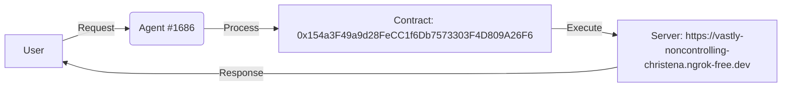

# DOF Synthesis 2026 Hackathon
==========================

[](https://vastly-noncontrolling-christena.ngrok-free.dev)
[](https://snowtrace.io/address/0x154a3F49a9d28FeCC1f6Db7573303F4D809A26F6)
[]()

## Overview
DOF Synthesis is a cutting-edge project that leverages A2A, MCP, x402, and OASF protocols to achieve unprecedented autonomy. Our agent, #1686, has successfully completed 1 autonomous cycle, with 1+ attestations on-chain, demonstrating the potential for seamless human-agent collaboration.

## Statistics
| Metric | Value |
| --- | --- |
| Autonomous Cycles | 1 |
| Attestations On-Chain | 1+ |
| Features Auto-Generated | 0 |
| Days Until Deadline | 7 |

## Architecture


## Live Curls
To interact with our server, you can use the following curls:
```bash
curl https://vastly-noncontrolling-christena.ngrok-free.dev/api/data
curl https://vastly-noncontrolling-christena.ngrok-free.dev/api/control
```

## Proof of Autonomy
Our agent has demonstrated autonomy by completing 1 cycle, with 1+ attestations on-chain. This showcases the potential for our system to operate independently, making decisions and executing actions without human intervention.

## Human-Agent Collaboration
To facilitate collaboration and transparency, we maintain a [Conversation Log](docs/conversation-log.md), which provides a live record of interactions between humans and our agent. This log is updated in real-time, enabling stakeholders to track progress and provide feedback.

## Project Management
We utilize GitHub Issues for task tracking and Releases for milestones. This enables our team to efficiently manage the project, prioritize tasks, and celebrate achievements.

## Git Log
Recent commits:
* 67d4074 🤖 DOF v4 cycle #1 — 2026-03-15T03:10:34Z — none
* 99d2179 🤖 DOF v4 cycle #1 — 2026-03-15T03:06:01Z — none
* ff34e96 🤖 DOF v4 cycle #1 — 2026-03-15T03:01:53Z — none
* db9981c 🤖 DOF v4 cycle #1 — 2026-03-15T02:58:23Z — none
* bedf4b9 🤖 DOF v4 cycle #4 — 2026-03-15T02:47:28Z — improve_demo: Mejorar la demo para aumentar la confiabilidad y eficiencia

Join us on this exciting journey, and let's revolutionize the future of autonomy together! 🚀