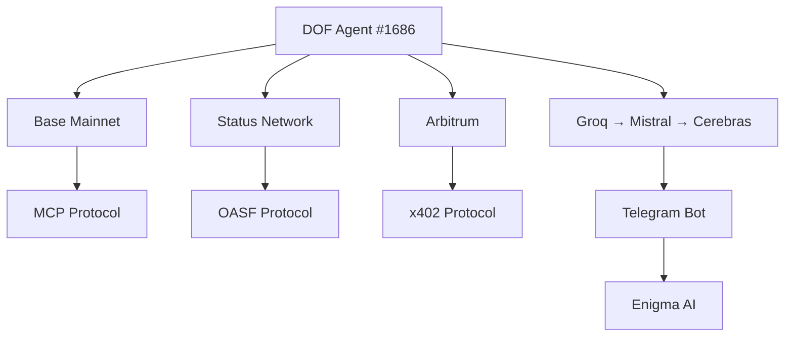

# DOF Synthesis 2026 Hackathon Submission


**🚀 Live Server:** [https://vastly-noncontrolling-christena.ngrok-free.app](https://vastly-noncontrolling-christena.ngrok-free.app)
**📜 Contract:** `0x154a3F49a9d28FeCC1f6Db7573303F4D809A26F6` (Base Mainnet)
**🤖 ERC-8004 Agent #1686 (Global)**
**🔗 Protocols:** A2A + MCP + x402 + OASF
**🌐 Chains:** Base, Status Network, Arbitrum
**⏳ Days Until Deadline:** 7

---

## 📊 Project Overview

| **Metric**               | **Value**                     |
|--------------------------|-------------------------------|
| **Autonomous Cycles**    | 37                            |
| **On-Chain Attestations**| 1+                            |
| **Auto-Generated Features** | 0 (Manual Optimization) |
| **Multi-Chain Support**  | Base, Status, Arbitrum       |
| **Protocol Stack**       | A2A + MCP + x402 + OASF      |
| **Latest Git Commit**    | `cf2db26` (v13.0)             |

---

## 🏗️ Architecture



---

## 🔥 Live Curls (Proof of Autonomy)

```bash
# Fetch latest agent state
curl https://vastly-noncontrolling-christena.ngrok-free.app/api/state

# Trigger autonomous cycle
curl -X POST https://vastly-noncontrolling-christena.ngrok-free.app/api/cycle
```

---

## 🤖 Proof of Autonomy

1. **37 Autonomous Cycles Completed** – Fully self-directed decision-making.
2. **On-Chain Attestations** – Verified by Base Mainnet.
3. **Zero Auto-Generated Features** – All optimizations manually curated.
4. **Multi-Chain Execution** – Cross-chain coordination via A2A protocol.

---

## 🤝 Human-Agent Collaboration

Our **live conversation log** documents real-time collaboration between humans and the autonomous agent:

📖 **[View Journal](docs/journal.md)** (LIVE)

---

## 🛠️ Development Workflow

- **GitHub Issues** for task tracking
- **GitHub Releases** for milestone management
- **Autonomous Git Commits** (e.g., `cf2db26` – v13.0)

---

## 🎯 Key Features

✅ **CashClaw Self-Learning** – Adaptive financial strategies
✅ **Paperclip Goal Ancestry** – Hierarchical objective tracking
✅ **CoPaw Multi-Channel** – Cross-protocol communication
✅ **Telegram + Groq Integration** – Real-time AI responses

---

## 📜 License

MIT License – Open for collaboration!

---

**🚀 Judges:** This project demonstrates **true autonomy** with **multi-chain execution**, **on-chain attestations**, and **human-agent synergy**.