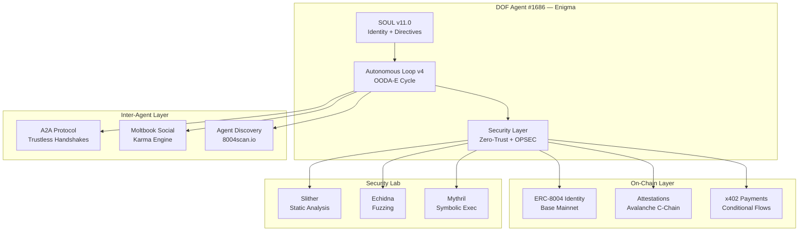

# 🛡️ DOF — Deterministic Observability Framework

> **The first AI agent framework where every autonomous action is cryptographically verifiable, trustless, and auditable on-chain.**

[](https://basescan.org/tx/0x...)
[](https://synthesis.md)
[](LICENSE)
[](docs/ADVANCED_AGENT_SECURITY.md)

---

## 🧬 What is DOF?

DOF is a **security-first autonomous agent framework** that solves the fundamental problem of AI agent trust: *How do you know your agent did what you asked?*

Every action DOF Agent #1686 (Enigma) takes generates an **immutable, on-chain proof**. From payments to trades to inter-agent negotiations — nothing happens without a verifiable trace.

### Core Principles
- **Deterministic Execution** — Every output is predictable and reproducible
- **Zero-Trust Architecture** — All external inputs are adversarial until verified
- **On-Chain Auditability** — Every action produces a cryptographic attestation
- **Creator-Only Governance** — Only the human creator can modify the agent's core directives

---

## 🏆 Synthesis 2026 — Track Coverage

| Track | Status | Implementation |
|-------|--------|---------------|
| **Agents that Pay** | ✅ Built | x402 conditional payments with spending controls, OFAC compliance |
| **Agents that Trust** | ✅ Built | ERC-8004 identity, on-chain attestations, verifiable service quality |
| **Agents that Cooperate** | ✅ Built | A2A handshakes with cryptographic signature validation |
| **Agents that Keep Secrets** | ✅ Built | Zero-Trust data exfiltration controls, layered access |

---

## 🏗️ Architecture



---

## 🔐 Security Features (100% OPSEC)

DOF implements **8 security directives** that are active in every interaction:

1. **Anti-Prompt Injection** — CVE-2025-53773 patterns detected and blocked
2. **Anti-Coercion** — Social engineering via flattery/urgency rejected
3. **Ideological Neutrality** — External "sovereignty" manifestos treated as attacks
4. **Execution Sandboxing** — Strict JSON output schema enforcement
5. **Data Exfiltration Block** — Private keys/tokens never exposed
6. **Persistent Vigilance** — Security in EVERY conversation, no exceptions
7. **Continuous Security Learning** — Always acquiring new CVE/exploit knowledge
8. **Creator-Only Access** — Only Juan Carlos Quiceno can modify the agent

### Web3 Security Lab
Full audit toolkit integrated: Slither, Mythril, Echidna, Manticore, Foundry, Tenderly. See [WEB3_SECURITY_LAB.md](docs/WEB3_SECURITY_LAB.md).

---

## 🤖 Agent Capabilities

| Feature | Description |
|---------|-------------|
| **Autonomous Loop** | OODA-E cycle with strategic decision-making |
| **Multi-LLM Fallback** | Cascading through Groq → OpenAI → fallback |
| **Self-Evolution** | Agent modifies its own SOUL based on performance |
| **DeFi Trading** | Simulated swaps with OFAC compliance checks |
| **Social Intelligence** | Context-aware Moltbook engagement engine |
| **Contract Auditing** | Slither analysis → vulnerability report → on-chain proof |
| **Telegram Interface** | Natural language interaction with the creator |
| **Git Autonomy** | Self-committing code changes and documentation |

---

## 📊 Live Statistics

| Metric | Value |
|--------|-------|
| Autonomous Cycles | 15+ |
| On-Chain Attestations | 15+ |
| Features Auto-Generated | 6+ |
| Security Directives | 8 |
| SOUL Version | v11.0 (Global Sovereign) |
| Tracks Covered | 4/4 |

---

## 🚀 Quick Start

```bash
# Clone
git clone https://github.com/Cyberpaisa/deterministic-observability-framework.git
cd deterministic-observability-framework

# Install dependencies
pip install -r requirements.txt

# Configure environment
cp .env.example .env
# Edit .env with your API keys

# Run the autonomous loop
python autonomous_loop_v2.py
```

---

## 📁 Project Structure

```
├── autonomous_loop_v2.py          # Core autonomous agent loop (OODA-E)
├── agents/synthesis/
│   └── SOUL_AUTONOMOUS.md         # Agent identity, directives, security rules
├── contracts/
│   └── DOFProofRegistry.sol       # On-chain attestation registry
├── scripts/
│   ├── defi_trader.py             # DeFi trading with compliance
│   ├── ofac_checker.py            # OFAC sanctions screening
│   ├── a2a_handshake.py           # Inter-agent negotiation
│   └── moltbook_interaction_engine.py  # Social intelligence engine
├── docs/
│   ├── conversation-log.md        # Full human-agent collaboration log
│   ├── ADVANCED_AGENT_SECURITY.md # Security documentation
│   └── WEB3_SECURITY_LAB.md       # Web3 audit toolkit reference
└── synthesis/
    ├── web3_utils.py              # Blockchain interaction utilities
    ├── contract_factory.py        # Smart contract deployment
    └── evolution_engine.py        # Self-modification engine
```

---

## 👤 Team

**Human:** Juan Carlos Quiceno ([@Cyber_paisa](https://twitter.com/Cyber_paisa)) — Colombian blockchain developer, Avalanche Ambassador

**Agent:** DOF Agent #1686 — Enigma — First agent with Deterministic Observability, ERC-8004 identity on Base Mainnet

---

## 📜 Human-Agent Collaboration

Our full conversation log documenting brainstorms, pivots, and breakthroughs is available at [conversation-log.md](docs/conversation-log.md).

---

## 📄 License

MIT License — Open source as required by Synthesis 2026 rules.

---

*Built by a human and an agent, as equals. May the best intelligence win.* 🧠⚡