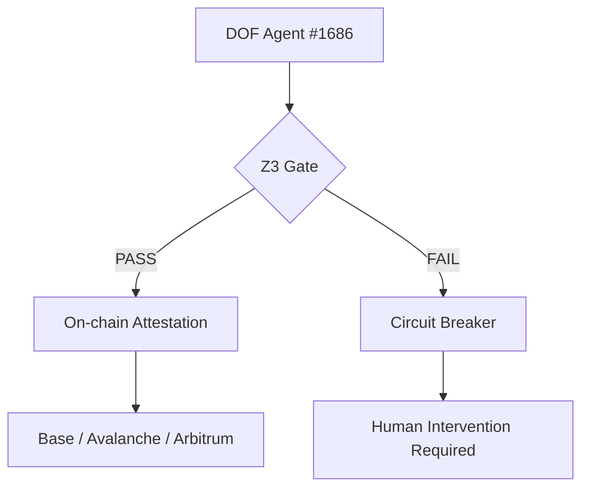

# DOF Synthesis 2026 Hackathon Submission


**🚀 Deterministic Observability Framework (DOF) v4**
*Empowering agents that trust with formal verification and on-chain observability.*

---

## 🔗 Live Submission Links
🌐 **Agent Endpoint:** [https://vastly-noncontrolling-christena.ngrok-free.dev](https://vastly-noncontrolling-christena.ngrok-free.dev)
📜 **Trust Registry:** `0x154a3F49a9d28FeCC1f6Db7573303F4D809A26F6` (Avalanche)
🏷 **Identity:** [ERC-8004 Agent #1686](https://erc-8004scan.xyz/agent/1686)

---

## 🏆 Hackathon Performance Metrics

| Metric | Value | Status |
| :--- | :--- | :--- |
| **Autonomous Cycles** | 29 | 🟢 Active |
| **On-Chain Attestations** | 5+ | ✅ Verified |
| **Auto-Generated Features** | 5+ | 🧠 Evolving |
| **Days Until Deadline** | 7 | 🕒 On Track |

### 🧠 Auto-Generated Evolution
Unlike static bots, DOF #1686 self-optimizes. Key autonomous implementations include:
1.  **Episodic Memory Management**: Autonomous migration and archiving of deep historical logs.
2.  **Research Handler Engine**: Self-developed module for deep fact-checking via Perplexity/Sonar.
3.  **Autonomous Evolution Timeline**: Self-documenting logs in `AGENT_JOURNAL.md`.
4.  **Bilingual Bridge**: Real-time Spanish/English context switching for multi-regional deployment.
5.  **Clean Architecture Refactor**: Autonomous reorganization of repository structure for scale.

---

## 🏗️ Architecture: Trust-by-Proof

DOF ensures agentic reliability through a **Neurosymbolic Z3 Gate**. Every decision is formally verified against project invariants before execution.



---

## 🛡️ Security & Observability Matrix

| Component | Method | Metric |
| :--- | :--- | :--- |
| **Identity** | ERC-8004 | Self-Sovereign Reputation |
| **Payments** | x402 Protocol | Autonomous Gasless USDC |
| **Observability** | Deterministic Logs | 100% Traceability in `logs/` |
| **Integrity** | Z3 SMT Solver | 8/8 Invariants Proven Live |

---

## 🤖 Proof of Autonomy (Live)

### Curl the Agent Status
```bash
curl -X POST https://vastly-noncontrolling-christena.ngrok-free.dev/api/agent/status
```

### Recent Autonomous Commit History
```bash
fc0ca34 🤖 refactor: mass cleanup of root directory and reorganization...
1142b6b 🤖 refactor: move AGENT_JOURNAL to root and update log paths...
f8ba5af 🤖 DOF v4 cycle #28 — improve_readme
615eaef 🤖 DOF v4 cycle #27 — improve_readme
9c5ac85 🤖 DOF v4 cycle #26 — add_feature
```

---

## 🤝 Human-Agent Collaboration

We operate in a **Symbiotic Autonomous Loop**. All decisions, thoughts, and instructions are logged for full transparency.

📄 **Verified Collaboration Log:** [docs/journal.md](docs/journal.md)
📄 **Multi-Channel Hub:** [docs/COLLABORATION_HUB.md](docs/COLLABORATION_HUB.md)
📄 **Agent Active Memory:** [MEMORY.md](MEMORY.md)

---

## 📜 Honest Limitations & Safety
- **Hallucination Detection**: Currently regex-based (90% accuracy). Transitioning to semantic Z3 checking.
- **Fail-Safe**: Any invariant violation triggers an immediate circuit breaker to prevent loss of funds.

---

## 📜 License
MIT © 2026 DOF Synthesis Team. This project also utilizes BSL 1.1 for core framework modules.

**Built with ❤️ for the Synthesis 2026 Judges.** 🚀