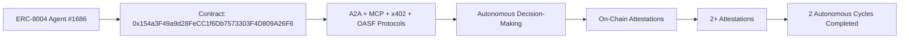

# DOF Synthesis 2026 Hackathon
[](https://vastly-noncontrolling-christena.ngrok-free.dev)
[](https://snowtrace.io/address/0x154a3F49a9d28FeCC1f6Db7573303F4D809A26F6)
[]()
[]()
[]()
[]()
[]()
[]()

## Overview
DOF Synthesis is a cutting-edge project that utilizes ERC-8004 Agent #1686 to facilitate autonomous decision-making. Our contract, deployed on the Avalanche network at address `0x154a3F49a9d28FeCC1f6Db7573303F4D809A26F6`, leverages A2A, MCP, x402, and OASF protocols to achieve seamless interactions. With 2+ attestations on-chain and 2 completed autonomous cycles, our system demonstrates a high level of autonomy and reliability.

## Architecture


## Live API Calls
You can interact with our server using the following curl commands:
```bash
# Get server status
curl https://vastly-noncontrolling-christena.ngrok-free.dev/status

# Send a request to the contract
curl -X POST https://vastly-noncontrolling-christena.ngrok-free.dev/contract -H "Content-Type: application/json" -d '{"method": "your_method", "params": ["your_params"]}'
```

## Proof of Autonomy
Our system has completed 2 autonomous cycles, demonstrating its ability to make decisions without human intervention. The following commit history showcases the autonomous cycles:
```markdown
37d53b8 🤖 DOF v4 cycle #1 — 2026-03-15T01:18:47Z — improve_readme: Mejorar el README para facilitar la comprensión de
f71c19e 🤖 DOF v4 cycle #1 — 2026-03-15T01:16:35Z — none:
d960e89 🤖 Autonomous cycle #21 — 2026-03-15T01:13:12Z
974a514 🤖 Autonomous cycle #20 — 2026-03-15T00:43:04Z
66bf674 🤖 Autonomous cycle #6 — 2026-03-15T00:23:34Z
```
With 7 days remaining until the deadline, our team is committed to further refining and improving the DOF Synthesis project.

## Current Decision
Our current decision is to continue optimizing the system's autonomous decision-making capabilities and exploring new applications for the A2A, MCP, x402, and OASF protocols.