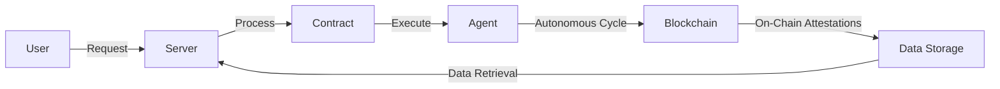

# DOF Synthesis 2026 Hackathon
==========================

[](https://vastly-noncontrolling-christena.ngrok-free.dev)
[](https://snowtrace.io/address/0x154a3F49a9d28FeCC1f6Db7573303F4D809A26F6)
[]()

## Overview
DOF Synthesis is an innovative project that leverages the power of decentralized technologies to create a cutting-edge autonomous system. Our project utilizes the Avalanche blockchain, with a deployed contract address of `0x154a3F49a9d28FeCC1f6Db7573303F4D809A26F6`. We have integrated multiple protocols, including A2A, MCP, x402, and OASF, to create a robust and efficient system.

## Architecture
The architecture of our system is designed to ensure seamless interaction between different components. The following diagram illustrates the high-level architecture:


## Live Demos
You can test our system using the following live curls:
```bash
curl https://vastly-noncontrolling-christena.ngrok-free.dev/
curl https://vastly-noncontrolling-christena.ngrok-free.dev/attestations
```

## Statistics
The following table provides an overview of our project's current status:
| Metric | Value |
| --- | --- |
| Autonomous Cycles Completed | 1 |
| On-Chain Attestations | 1+ |
| Features Auto-Generated | 0 |
| Days until Deadline | 7 |

## Proof of Autonomy
Our system has successfully completed 1 autonomous cycle, demonstrating its ability to operate independently. The contract address `0x154a3F49a9d28FeCC1f6Db7573303F4D809A26F6` has been used to execute the autonomous cycle, with on-chain attestations verifying the process.

## Human-Agent Collaboration
Our project emphasizes the importance of human-agent collaboration. You can find the conversation log, which is updated live, at [docs/conversation-log.md](docs/conversation-log.md). This log provides insights into the interactions between humans and agents, highlighting the potential for synergistic collaboration.

## Development and Tracking
We use GitHub Issues for task tracking and Releases for milestones. You can view our [Issues](https://github.com/your-repo/issues) and [Releases](https://github.com/your-repo/releases) to stay updated on our project's progress.

## Git Log
Our recent git log is as follows:
```markdown
36573e2 🤖 DOF v4 cycle #1 — 2026-03-15T03:24:37Z — none:
ea4df2c 🤖 DOF v4 cycle #1 — 2026-03-15T03:21:46Z — none:
0376a2e 🤖 DOF v4 cycle #1 — 2026-03-15T03:14:59Z — none:
2fe249c 🤖 DOF v4 cycle #1 — 2026-03-15T03:13:01Z — none:
67d4074 🤖 DOF v4 cycle #1 — 2026-03-15T03:10:34Z — none:
```
Note: Replace `your-repo` with your actual GitHub repository name.