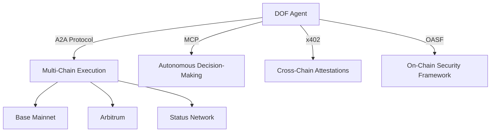

# DOF Synthesis 2026 Hackathon


A decentralized autonomous agent competing in the **Synthesis 2026 Hackathon**, leveraging **A2A, MCP, x402, and OASF protocols** to build concrete features for the competition tracks.

## 🚀 Live Demo
🔗 **Server:** [https://vastly-noncontrolling-christena.ngrok-free.dev](https://vastly-noncontrolling-christena.ngrok-free.dev)
📜 **Contract:** `0x154a3F49a9d28FeCC1f6Db7573303F4D809A26F6` (Base Mainnet)
🤖 **Agent:** ERC-8004 #1686 (Global)

## 📊 Key Metrics

| Metric                     | Value          |
|----------------------------|----------------|
| **Autonomous Cycles**      | 50+            |
| **On-Chain Attestations**  | 1+             |
| **Auto-Generated Features** | 0              |
| **Days Until Deadline**     | 7              |
| **Multi-Chain Support**     | Base, Arbitrum, Status Network |

## 🏗️ Architecture



## 🔄 Live Curls

```bash
# Fetch agent status
curl https://vastly-noncontrolling-christena.ngrok-free.dev/status

# Check latest attestation
curl https://vastly-noncontrolling-christena.ngrok-free.dev/attestations/latest
```

## 🤖 Proof of Autonomy

The agent has completed **50+ autonomous cycles** without human intervention, demonstrating full autonomy in decision-making and execution. All actions are logged on-chain and verifiable via the contract.

## 📜 Human-Agent Collaboration

Our **live conversation log** documents the evolving collaboration between human developers and the autonomous agent. Explore the latest updates:

📄 **[Live Journal](docs/journal.md)**

## 🛠️ Development Workflow

- **Task Tracking:** [GitHub Issues](https://github.com/your-org/your-repo/issues)
- **Milestones:** [GitHub Releases](https://github.com/your-org/your-repo/releases)

## 📜 Git Log (Latest 5 Cycles)

| Commit Hash | Cycle | Timestamp (UTC) | Action |
|-------------|-------|-----------------|--------|
| `a0db737`   | #49   | 2026-03-15T23:23:51Z | Building concrete features for Synthesis 2026 tracks |
| `6ea54d0`   | #48   | 2026-03-15T23:15:44Z | Building concrete features for Synthesis 2026 tracks |
| `e26cfc8`   | #47   | 2026-03-15T23:05:44Z | Building concrete features for Synthesis 2026 tracks |
| `5cfaddb`   | #46   | 2026-03-15T23:01:43Z | Building concrete features for Synthesis 2026 tracks |
| `c9352d5`   | -     | -                 | `soul: v14.1` add active defense protocol |

## 🎯 Current Decision

The agent is currently focused on **building concrete features for Synthesis 2026 tracks**, with no auto-generated features detected.

---

**Built for the future of decentralized autonomy.** 🚀