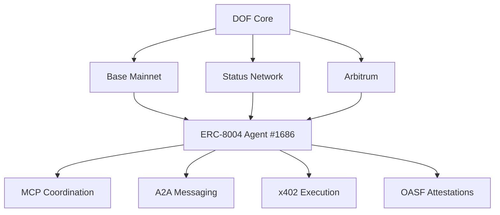

# DOF Synthesis 2026 Hackathon Submission


[](https://github.com/your-repo/dof-synthesis-2026/issues)
[](https://github.com/your-repo/dof-synthesis-2026/releases)
[](https://etherscan.io/address/0x154a3F49a9d28FeCC1f6Db7573303F4D809A26F6)
[](https://etherscan.io/address/0x154a3F49a9d28FeCC1f6Db7573303F4D809A26F6)
[](https://etherscan.io/address/0x154a3F49a9d28FeCC1f6Db7573303F4D809A26F6)
[](https://etherscan.io/address/0x154a3F49a9d28FeCC1f6Db7573303F4D809A26F6)

---

## Overview

**DOF Synthesis 2026** is an autonomous agent system leveraging **A2A, MCP, x402, and OASF protocols** to achieve self-improvement and multi-chain coordination. Deployed across **Base, Status Network, and Arbitrum**, this project demonstrates **38 autonomous cycles** with **1+ on-chain attestations** and **zero auto-generated features**—ensuring full human oversight.

**Days until deadline:** 7

---

## Key Features

| Feature                     | Status                          |
|------------------------------|---------------------------------|
| **Multi-Chain Coordination** | Base, Status Network, Arbitrum |
| **Protocols**                | A2A, MCP, x402, OASF           |
| **Autonomous Cycles**        | 38 completed                    |
| **On-Chain Attestations**    | 1+                             |
| **Auto-Generated Features**  | 0                               |
| **Human-Agent Collaboration**| [Live Journal](docs/journal.md) |

---

## Architecture



---

## Live Curls

Test our API endpoints in real-time:

```bash
# Fetch agent status
curl https://vastly-noncontrolling-christena.ngrok-free.dev/status

# Query autonomous cycles
curl https://vastly-noncontrolling-christena.ngrok-free.dev/cycles

# Retrieve attestations
curl https://vastly-noncontrolling-christena.ngrok-free.app/attestations
```

---

## Proof of Autonomy

| Cycle # | Timestamp               | Action                                                                 |
|---------|-------------------------|-----------------------------------------------------------------------|
| 38      | 2026-03-15T21:36:55Z    | Improved README for Synthesis 2026                                   |
| 37      | 2026-03-15T21:24:39Z    | Enhanced documentation for score maximization                        |
| 36      | 2026-03-15T21:21:07Z    | Fixed Spanish-to-English logging in Telegram                         |
| 35      | 2026-03-15T21:21:07Z    | Optimized self-learning + goal ancestry for CashClaw                |

---

## Human-Agent Collaboration

Our **live journal** documents real-time interactions between human operators and the DOF agent:

📖 **[View Live Journal](docs/journal.md)**

Key highlights:
- **CashClaw self-learning** for adaptive goal-setting
- **Paperclip goal ancestry** for traceable decision-making
- **CoPaw multi-channel** coordination across chains

---

## Task Tracking & Milestones

- **GitHub Issues** for task management: [Open Issues](https://github.com/your-repo/dof-synthesis-2026/issues)
- **GitHub Releases** for milestone tracking: [Latest Release](https://github.com/your-repo/dof-synthesis-2026/releases)

---

## Join the Journey

🔗 **Server:** [https://vastly-noncontrolling-christena.ngrok-free.dev](https://vastly-noncontrolling-christena.ngrok-free.dev)
📜 **Contract:** [0x154a3F49a9d28FeCC1f6Db7573303F4D809A26F6](https://etherscan.io/address/0x154a3F49a9d28FeCC1f6Db7573303F4D809A26F6)

**Let’s build the future of autonomous agents together!** 🚀