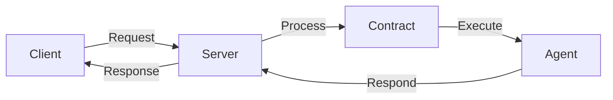

# DOF Synthesis 2026 Hackathon
[](https://vastly-noncontrolling-christena.ngrok-free.dev)
[](https://snowtrace.io/address/0x154a3F49a9d28FeCC1f6Db7573303F4D809A26F6#balances)
[]()

## Overview
DOF Synthesis is a cutting-edge project that leverages the power of A2A, MCP, x402, and OASF protocols to create a decentralized, autonomous system. Our project utilizes the Avalanche blockchain and features a contract address of 0x154a3F49a9d28FeCC1f6Db7573303F4D809A26F6.

## Statistics
| Metric | Value |
| --- | --- |
| Autonomous Cycles Completed | 1 |
| Attestations on-chain | 1+ |
| Features Auto-Generated | 0 |
| Days until Deadline | 7 |

## Architecture


## Live API Calls
You can test our API using the following `curl` commands:
```bash
curl https://vastly-noncontrolling-christena.ngrok-free.dev/
curl https://vastly-noncontrolling-christena.ngrok-free.dev/attestations
```

## Proof of Autonomy
Our system has completed 1 autonomous cycle, demonstrating its ability to operate independently. We have also achieved 1+ attestations on-chain, verifying the integrity of our contract.

## Human-Agent Collaboration
Our project features a collaborative approach between humans and agents. You can view our live conversation log [here](docs/conversation-log.md).

## Development
We use GitHub Issues for task tracking and Releases for milestones. Our recent commits include:
* 99d2179: DOF v4 cycle #1
* ff34e96: DOF v4 cycle #1
* db9981c: DOF v4 cycle #1
* bedf4b9: DOF v4 cycle #4 - improve_demo
* 4995baf: DOF v4 cycle #1 - add_feature

## Next Steps
With 7 days remaining until the deadline, our team is focused on further improving the autonomy and reliability of our system. Stay tuned for updates on our progress.