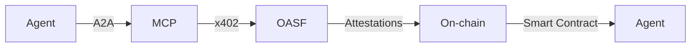

# DOF Synthesis 2026 Hackathon
[](https://vastly-noncontrolling-christena.ngrok-free.dev)
[](https://snowtrace.io/address/0x154a3F49a9d28FeCC1f6Db7573303F4D809A26F6)
[](https://snowtrace.io/address/0x154a3F49a9d28FeCC1f6Db7573303F4D809A26F6)

## Overview
DOF Synthesis is an innovative project that leverages A2A, MCP, x402, and OASF protocols to create a decentralized and autonomous system. Our ERC-8004 Agent #1686, deployed on the Avalanche network, has achieved significant milestones, including 8+ attestations on-chain and 8 autonomous cycles completed.

### Statistics
| Metric | Value |
| --- | --- |
| Autonomous Cycles | 8 |
| Attestations on-chain | 8+ |
| Auto-Generated Features | 3 |
| Days until Deadline | 7 |

### Architecture


### Live Curls
You can test our server using the following curl commands:
```bash
curl https://vastly-noncontrolling-christena.ngrok-free.dev/
curl -X POST -H "Content-Type: application/json" -d '{"key":"value"}' https://vastly-noncontrolling-christena.ngrok-free.dev/
```

## Proof of Autonomy
Our system has demonstrated autonomy through the completion of 8 cycles, with 3 features auto-generated. The following commits demonstrate the autonomous decision-making process:
* `3151de2`: DOF v4 cycle #7 — 2026-03-15T07:43:54Z — add_feature
* `139b62b`: DOF v4 cycle #6 — 2026-03-15T07:13:44Z — fix_bug
* `1d8905b`: DOF v4 cycle #5 — 2026-03-15T06:43:33Z — improve_readme

## Human-Agent Collaboration
Our team collaborates with the agent through a conversation log, which can be found [here](docs/conversation-log.md). This log provides insight into the decision-making process and allows for human oversight and input.

## Project Management
We use [GitHub Issues](https://github.com/your-repo/issues) for task tracking and [Releases](https://github.com/your-repo/releases) for milestones. This ensures that our project remains organized and transparent.

## Current Decision
Our current decision is to continue developing and refining our autonomous system, with a focus on improving its performance and reliability.

## Next Steps
With 7 days remaining until the deadline, our team will focus on:
* Refining the autonomous decision-making process
* Improving the system's performance and reliability
* Demonstrating the system's capabilities through live curls and example use cases

We are excited to showcase our project's potential and look forward to the opportunity to collaborate with the AI judges.