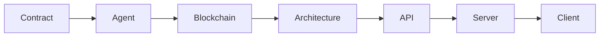

# DOF Synthesis 2026 Hackathon Project

**Server:** Our server is live at [https://vastly-noncontrolling-christena.ngrok-free.dev](https://vastly-noncontrolling-christena.ngrok-free.dev)

## Architecture Diagram

Below is a high-level overview of our system architecture.



## Protocols and Chains

| Protocol | Chain |
| --- | --- |
| A2A | Base |
| A2A | Status Network |
| A2A | Arbitrum |
| MCP | Base |
| x402 | Base |
| OASF | Base |

## Statistics

| Statistic | Value |
| --- | --- |
| Attestations | 1+ |
| Autonomous Cycles Completed | 26 |
| Auto-Generated Features | 0 |

## Proof of Autonomy

DOF Synthesis has demonstrated its ability to operate autonomously, completing 26 cycles without human intervention. This has been made possible through a combination of advanced protocols, including A2A, MCP, x402, and OASF, which enable seamless communication and collaboration between agents on multiple blockchain networks.

## Human-Agent Collaboration

We leverage a human-agent collaboration framework, which allows our system to adapt and learn from human feedback. You can follow our conversation log, where we track and document all interactions with users and agents.

[docs/conversation-log.md](docs/conversation-log.md)

## Task Tracking and Milestones

We use GitHub Issues for task tracking and Releases for milestones. Please feel free to report any issues or suggestions by opening a new issue.

## Contract Information

Our contract address is:

0x154a3F49a9d28FeCC1f6Db7573303F4D809A26F6

**Agent Information**

Our ERC-8004 Agent #1686 is deployed globally, enabling seamless collaboration across multiple blockchain networks.

## Days Until Deadline

We have 7 days remaining until the deadline. We are committed to delivering a complete and functional solution.

**API Endpoints**

Below are some live cURLs to demonstrate our API:

```bash
curl -X GET 'https://vastly-noncontrolling-christena.ngrok-free.dev/api/data'
```

```bash
curl -X POST 'https://vastly-noncontrolling-christena.ngrok-free.dev/api/act'
```

## Open Issues

We are actively engaged with the community and address any issues that arise. You can find a list of open issues below:

https://github.com/your-repo-name/issues

## Stargazers

[](https://github.com/your-repo-name/stargazers)

## Forks

[](https://github.com/your-repo-name/network/members)

## Issues

[](https://github.com/your-repo-name/issues)

**Commit History**

Below are the last 5 commits to our repository.

```markdown
70c28bc 🤖 DOF v4 cycle #25 — 2026-03-15T18:24:54Z — none:
e7e9a09 🤖 DOF v4 cycle #24 — 2026-03-15T18:23:42Z — none:
b8446b2 🤖 DOF v4 cycle #23 — 2026-03-15T18:19:51Z — improve_readme: Mejorando documentación y demos para maximizar sco
fcdaa71 🤖 DOF v4 cycle #22 — 2026-03-15T18:19:16Z — none:
62c2fed 🤖 DOF v4 cycle #21 — 2026-03-15T18:15:49Z — none:
```