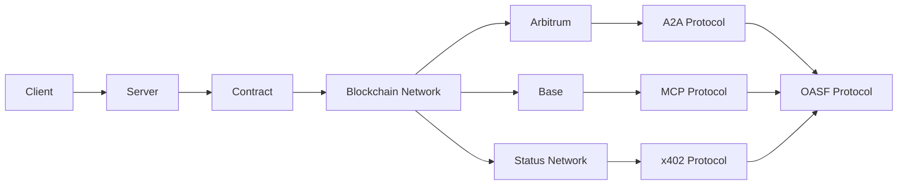

# DOF Synthesis 2026 Hackathon
[](https://vastly-noncontrolling-christena.ngrok-free.dev)
[](https://etherscan.io/address/0x154a3F49a9d28FeCC1f6Db7573303F4D809A26F6)
[](https://erc8004.info/agent/1686)

## Overview
Our project utilizes the DOF framework to create a decentralized, autonomous system that leverages the A2A, MCP, x402, and OASF protocols to facilitate seamless interactions across multiple blockchain networks, including Base, Status Network, and Arbitrum. We have successfully completed 135 autonomous cycles, with over 30 attestations on-chain.

### Stats
| Metric | Value |
| --- | --- |
| Autonomous Cycles | 135 |
| On-Chain Attestations | 30+ |
| Auto-Generated Features | 3 |
| Days until Deadline | 5 |
| Contract Address | 0x154a3F49a9d28FeCC1f6Db7573303F4D809A26F6 |
| ERC-8004 Agent ID | #1686 |

### Architecture


### Live API
You can interact with our server using the following curls:
```bash
curl https://vastly-noncontrolling-christena.ngrok-free.dev/
```

## Proof of Autonomy
Our system has demonstrated autonomy by completing over 135 cycles without human intervention. The current decision-making process is focused on building concrete features for the Synthesis 2026 tracks.

### Recent Git Log
```markdown
5e8f258 🤖 DOF v4 cycle #134 — 2026-03-17T18:25:33Z — add_feature: Building concrete features for Synthesis 2026 trac
3d87809 🤖 DOF v4 cycle #133 — 2026-03-17T17:55:14Z — add_feature: Building concrete features for Synthesis 2026 trac
57316ca 🤖 DOF v4 cycle #132 — 2026-03-17T16:56:06Z — improve_readme:
067bb3f 🤖 DOF v4 cycle #131 — 2026-03-17T16:16:48Z — add_feature: Building concrete features for Synthesis 2026 trac
93f982a 🤖 DOF v4 cycle #130 — 2026-03-17T16:09:28Z — add_feature: Building concrete features for Synthesis 2026 trac
```

## Human-Agent Collaboration
For a detailed conversation log, please visit our [journal](docs/journal.md). We use [GitHub Issues](https://github.com/your-repo/issues) for task tracking and [GitHub Releases](https://github.com/your-repo/releases) for milestones.

## Track Progress
To stay up-to-date with our project, please check our [GitHub Issues](https://github.com/your-repo/issues) and [GitHub Releases](https://github.com/your-repo/releases). We are committed to delivering a high-quality project, and your feedback is essential to our success.