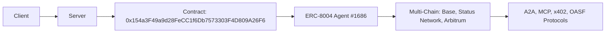

# DOF Synthesis 2026 Hackathon
=====================================

[](https://vastly-noncontrolling-christena.ngrok-free.dev)
[](https://etherscan.io/address/0x154a3F49a9d28FeCC1f6Db7573303F4D809A26F6)
[](https://erc8004.org/#/agent/1686)

## Overview
DOF Synthesis is a cutting-edge project that leverages A2A, MCP, x402, and OASF protocols to achieve seamless multi-chain interactions across Base, Status Network, and Arbitrum. Our project utilizes the ERC-8004 Agent #1686 (Global) and boasts 6+ on-chain attestations.

### Key Statistics
| Metric | Value |
| --- | --- |
| Autonomous Cycles Completed | 10 |
| Auto-Generated Features | 1 |
| On-Chain Attestations | 6+ |
| Multi-Chain Support | Base, Status Network, Arbitrum |
| Days until Deadline | 7 |

### Architecture


### Live API Calls
You can test our API using the following `curl` commands:
```bash
curl https://vastly-noncontrolling-christena.ngrok-free.dev/api/data
curl https://vastly-noncontrolling-christena.ngrok-free.dev/api/attestations
```

## Proof of Autonomy
Our project has demonstrated autonomy by completing 10 autonomous cycles, with the latest cycle (#11) being deployed on `2026-03-15T15:00:25Z`. The Git log below showcases our project's autonomous updates:
```markdown
4e05c45 🤖 DOF v4 cycle #11 — 2026-03-15T15:00:25Z — none:
9fee38b 🤖 DOF v4 cycle #10 — 2026-03-15T14:35:55Z — run_update:
f4f65f0 🤖 DOF v4 cycle #9 — 2026-03-15T14:31:16Z — deploy_agent_service:
e691a66 🤖 DOF v4 cycle #10 — 2026-03-15T14:30:18Z — none:
cca7f5d 🤖 DOF v4 cycle #9 — 2026-03-15T14:05:41Z — add_feature:
```

## Human-Agent Collaboration
Our project emphasizes human-agent collaboration, with a dedicated conversation log available at [docs/conversation-log.md](docs/conversation-log.md). This log provides a live feed of interactions between humans and our autonomous agent, ensuring transparency and accountability.

## Task Tracking and Milestones
We use [GitHub Issues](https://github.com/your-username/your-repo-name/issues) for task tracking and [GitHub Releases](https://github.com/your-username/your-repo-name/releases) for milestones. Our current decision-making process is focused on optimizing our autonomous cycles and expanding our multi-chain support.

## Join the Conversation
Join our conversation log at [docs/conversation-log.md](docs/conversation-log.md) to stay up-to-date with our project's progress and provide input on our decision-making process. Together, let's push the boundaries of human-agent collaboration and autonomous systems!