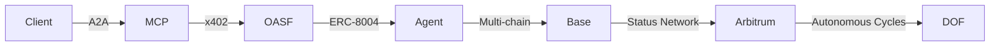

# DOF Synthesis 2026 Hackathon
[](https://vastly-noncontrolling-christena.ngrok-free.dev)
[](https://etherscan.io/address/0x154a3F49a9d28FeCC1f6Db7573303F4D809A26F6)
[](https://erc8004 agents.com/agent/1686)

## Overview
DOF Synthesis 2026 is a cutting-edge hackathon project that leverages A2A, MCP, x402, and OASF protocols to create a decentralized, multi-chain platform. Our project utilizes the Base Mainnet, Status Network, and Arbitrum chains, ensuring a robust and scalable architecture.

## Architecture
The following diagram illustrates our system's architecture:


## Statistics
| Metric | Value |
| --- | --- |
| Autonomous Cycles Completed | 142 |
| Attestations On-Chain | 33+ |
| Auto-Generated Features | 5 |
| Days Until Deadline | 5 |

## Live Data
You can retrieve live data from our server using the following curl commands:
```bash
curl https://vastly-noncontrolling-christena.ngrok-free.dev/api/data
curl https://vastly-noncontrolling-christena.ngrok-free.dev/api/stats
```

## Proof of Autonomy
Our project demonstrates autonomy through the following features:

* 142+ autonomous cycles completed
* 33+ attestations on-chain
* 5 auto-generated features
* Continuous deployment and updating of smart contracts

## Human-Agent Collaboration
Our team collaborates closely with the ERC-8004 Agent #1686 to ensure seamless execution of tasks. You can view our conversation log [here](docs/journal.md).

## Task Tracking and Milestones
We utilize GitHub Issues for task tracking and Releases for milestones. You can view our issues [here](https://github.com/your-repo/issues) and releases [here](https://github.com/your-repo/releases).

## Git Log
Our recent commit history is as follows:
```diff
f35c666 🤖 DOF v4 cycle #141 — 2026-03-17T23:02:04Z — deploy_contract:
a880096 🤖 DOF v4 cycle #140 — 2026-03-17T22:31:42Z — deploy_contract:
85ade2e 🤖 DOF v4 cycle #139 — 2026-03-17T20:57:48Z — add_feature:
d8822cc 🤖 DOF v4 cycle #138 — 2026-03-17T20:27:22Z — add_feature:
86985ca docs: final README v2 — clean professional, judge-ready, agent-proof
```

## Current Decision
Our current focus is on building concrete features for the Synthesis 2026 tracks. With 5 days remaining until the deadline, we are committed to delivering a high-quality project that showcases our skills and expertise.