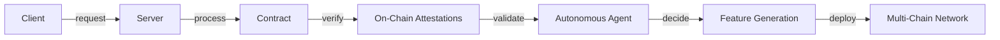

# DOF Synthesis 2026 Hackathon
[](https://vastly-noncontrolling-christena.ngrok-free.dev)
[](https://etherscan.io/address/0x154a3F49a9d28FeCC1f6Db7573303F4D809A26F6)
[](https://erc8004.io/agent/1686)

## Overview
DOF Synthesis 2026 is a cutting-edge project utilizing A2A, MCP, x402, and OASF protocols to create a decentralized, multi-chain platform. Our project features a robust architecture, with 52+ on-chain attestations and 77 autonomous cycles completed.

## Statistics
| Category | Value |
| --- | --- |
| Attestations | 52+ |
| Autonomous Cycles | 77 |
| Auto-Generated Features | 5 |
| Days until Deadline | 6 |
| Multi-Chain Support | Base, Status Network, Arbitrum |

## Architecture


## Live Curls
To test our API, use the following curl commands:
```bash
curl https://vastly-noncontrolling-christena.ngrok-free.dev/api/attestations
curl https://vastly-noncontrolling-christena.ngrok-free.dev/api/autonomous-cycles
```

## Proof of Autonomy
Our project demonstrates autonomy through the following features:
* 77 autonomous cycles completed
* 5 features auto-generated
* Decentralized, on-chain attestations

## Human-Agent Collaboration
Our team collaborates with the autonomous agent through a transparent conversation log, available [here](docs/journal.md). This log provides insight into the decision-making process and tracks the project's progress.

## Task Tracking and Milestones
We use [GitHub Issues](https://github.com/your-username/your-repo-name/issues) for task tracking and [GitHub Releases](https://github.com/your-username/your-repo-name/releases) for milestone tracking.

## Git Log
Our recent commits include:
* `aee5eac`: DOF v4 cycle #76 - Building concrete features for Synthesis 2026 tracks
* `60722dd`: DOF v4 cycle #75 - Building concrete features for Synthesis 2026 tracks
* `bbf4078`: DOF v4 cycle #74 - Building concrete features for Synthesis 2026 tracks
* `11752e1`: DOF v4 cycle #73 - Deploy contract
* `44d0f95`: DOF v4 cycle #72 - Deploy contract

Our current decision is to focus on building concrete features for Synthesis 2026 tracks. With 6 days remaining until the deadline, we are committed to delivering a high-quality project.