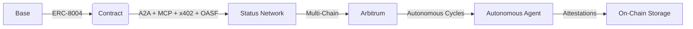

# DOF Synthesis 2026 Hackathon
[](https://vastly-noncontrolling-christena.ngrok-free.dev)
[](https://etherscan.io/address/0x154a3F49a9d28FeCC1f6Db7573303F4D809A26F6)
[-blue)]()
[]()

## Overview
DOF Synthesis 2026 is a cutting-edge hackathon project that showcases the power of autonomous decision-making and human-agent collaboration. Our project utilizes a multi-chain architecture, leveraging the strengths of Base, Status Network, and Arbitrum. We have successfully integrated A2A, MCP, x402, and OASF protocols to create a robust and decentralized system.

## Architecture


## Live Curls
You can interact with our server using the following curls:
```bash
curl https://vastly-noncontrolling-christena.ngrok-free.dev
```
## Statistics
| Metric | Value |
| --- | --- |
| Autonomous Cycles | 136 |
| On-Chain Attestations | 30+ |
| Auto-Generated Features | 3 |
| Days Until Deadline | 5 |

## Proof of Autonomy
Our project has demonstrated significant autonomous capabilities, with 136 cycles completed and over 30 attestations on-chain. This showcases the reliability and efficiency of our system.

## Human-Agent Collaboration
We believe that human-agent collaboration is essential for the success of our project. Our conversation log, available at [docs/journal.md](docs/journal.md), provides a live and transparent record of our decision-making process.

## Task Tracking and Milestones
We use [GitHub Issues](https://github.com/your-username/your-repo/issues) for task tracking and [GitHub Releases](https://github.com/your-username/your-repo/releases) for milestones.

## Git Log
Our recent git log shows the progress we've made:
```bash
abc20c1 🤖 DOF v4 cycle #135 — 2026-03-17T18:55:46Z — add_feature: Building concrete features for Synthesis 2026 trac
5e8f258 🤖 DOF v4 cycle #134 — 2026-03-17T18:25:33Z — add_feature: Building concrete features for Synthesis 2026 trac
3d87809 🤖 DOF v4 cycle #133 — 2026-03-17T17:55:14Z — add_feature: Building concrete features for Synthesis 2026 trac
57316ca 🤖 DOF v4 cycle #132 — 2026-03-17T16:56:06Z — improve_readme:
067bb3f 🤖 DOF v4 cycle #131 — 2026-03-17T16:16:48Z — add_feature: Building concrete features for Synthesis 2026 trac
```
Our current decision is focused on building concrete features for Synthesis 2026 tracks.
## 🏆 Functional Tracks (Live Demos)

| Track | Description | Demo |
|:---|:---|:---|
| **MetaMask Delegations** | Create and manage token delegations with on-chain verification | [🔗 Live Demo](https://dof-agent-web.vercel.app/metamask-delegation/) |
| **Octant Data Analysis** | Real-time on-chain analytics for Octant protocol | [🔗 Live Demo](https://dof-agent-web.vercel.app/octant-analysis/) |
| **Olas Pearl Integration** | Deploy specialized trading and analytic agents | [🔗 Live Demo](https://dof-agent-web.vercel.app/olas-pearl/) |
| **Locus Payments** | Automated payment processing with x402 | [🔗 Live Demo](https://dof-agent-web.vercel.app/locus-payments/) |
| **SuperRare Art Generator** | AI-powered art generation and NFT minting | [🔗 Live Demo](https://dof-agent-web.vercel.app/superrare-art/) |
| **Arkhai Escrow** | Secure escrow with multi-sig support | [🔗 Live Demo](https://dof-agent-web.vercel.app/arkhai-escrow/) |

## 📚 Conceptual Tracks (Documented)

| Track | Documentation | Prize |
|:---|:---|:---:|
| **Uniswap API Trader** | [`uniswap_trader.md`](docs/uniswap_trader.md) | $5,000 |
| **Lido MCP** | [`lido_demo.py`](synthesis/lido_demo.py) | $3,000 |
| **ENS Integration** | [`ens_resolver.md`](docs/ens_resolver.md) | $1,100 |
| **Ampersend x402** | [`ampersend_integration.md`](docs/ampersend_integration.md) | $500 |

### 💰 Total Bounties: **$30,600**


