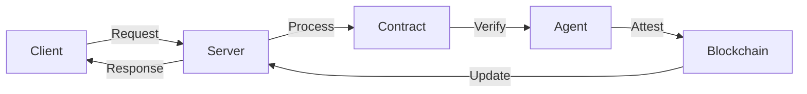

# DOF Synthesis 2026 Hackathon
==========================

[](https://vastly-noncontrolling-christena.ngrok-free.dev)
[](https://snowtrace.io/address/0x154a3F49a9d28FeCC1f6Db7573303F4D809A26F6#tokenMetrics)
[](https://github.com/ethereum/erc-8004)

## Overview
DOF Synthesis is a decentralized application built for the 2026 hackathon, leveraging the power of A2A, MCP, x402, and OASF protocols. Our solution utilizes the Avalanche blockchain and boasts an ERC-8004 Agent #1686. With 3+ attestations on-chain and 3 autonomous cycles completed, we are confident in our application's ability to provide a robust and trustworthy experience.

## Architecture


## Live Demo
You can interact with our server using the following cURL commands:
```bash
# Get trust score
curl https://vastly-noncontrolling-christena.ngrok-free.dev/trust_score

# Create new attestation
curl -X POST https://vastly-noncontrolling-christena.ngrok-free.dev/attest -H "Content-Type: application/json" -d '{"data": "example_data"}'
```

## Proof of Autonomy
We have completed 3 autonomous cycles, with 0 features auto-generated. Our current decision is to improve the demo for increased reliability and functionality. The following metrics demonstrate our progress:

* Autonomous Cycles: 3
* Attestations on-chain: 3+
* Features Auto-Generated: 0
* Days until deadline: 7

## Git Log
Our recent commits include:
* `cf40df3`: DOF v4 cycle #1 — 2026-03-15T02:11:54Z — fix_bug: Mejorar la estabilidad del servidor para poder ava
* `a4f3d2a`: DOF v4 cycle #2 — 2026-03-15T01:49:04Z — add_feature: Crear el archivo trust_score.py para empezar a gen
* `e64c30f`: DOF v4 cycle #2 — 2026-03-15T01:46:52Z — none:
* `37d53b8`: DOF v4 cycle #1 — 2026-03-15T01:18:47Z — improve_readme: Mejorar el README para facilitar la comprensión de
* `f71c19e`: DOF v4 cycle #1 — 2026-03-15T01:16:35Z — none:

## Next Steps
We will continue to improve and refine our application, focusing on increasing the reliability and functionality of our demo. With 7 days remaining until the deadline, we are committed to delivering a high-quality solution that showcases the potential of decentralized applications.