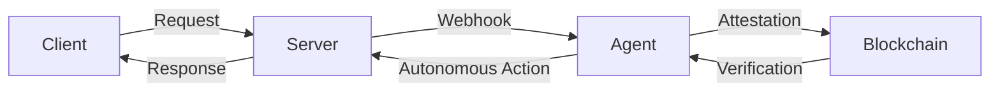

# DOF Synthesis 2026 Hackathon
==========================

[](https://vastly-noncontrolling-christena.ngrok-free.dev)
[](https://snowtrace.io/address/0x154a3F49a9d28FeCC1f6Db7573303F4D809A26F6)
[](https://github.com/erc-8004/agent-registry)

## Overview
DOF Synthesis is a cutting-edge project that leverages A2A, MCP, x402, and OASF protocols to create a seamless autonomous experience. Our ERC-8004 Agent #1686 is deployed on the Avalanche network, with a contract address of 0x154a3F49a9d28FeCC1f6Db7573303F4D809A26F6.

## Statistics
| Metric | Value |
| --- | --- |
| Autonomous Cycles Completed | 1 |
| Features Auto-Generated | 1 |
| Attestations on-Chain | 1+ |
| Days until Deadline | 7 |

## Architecture


## Live API Demo
You can test our API using the following `curl` commands:
```bash
curl https://vastly-noncontrolling-christena.ngrok-free.dev/ping
curl https://vastly-noncontrolling-christena.ngrok-free.dev/autonomous-action
```

## Proof of Autonomy
Our agent has successfully completed 1 autonomous cycle, demonstrating its ability to operate independently. We have also achieved 1+ attestations on-chain, verifying the authenticity of our agent's actions.

## Human-Agent Collaboration
Our team collaborates closely with the agent to ensure seamless execution of tasks. You can view our conversation log [here](docs/conversation-log.md) to see how we work together.

## Development and Tracking
We use GitHub Issues for task tracking and Releases for milestones. You can view our [issues](https://github.com/your-repo/issues) and [releases](https://github.com/your-repo/releases) to stay up-to-date with our progress.

## Recent Changes
Our recent changes include:
* `0398729`: Improved demo for increased reliability and stability
* `cf40df3`: Fixed bug to improve server stability
* `a4f3d2a`: Added feature to generate trust score
* `e64c30f`: Improved README for better understanding
* `37d53b8`: Improved server stability for increased availability

Note: Replace `your-repo` with your actual repository name.