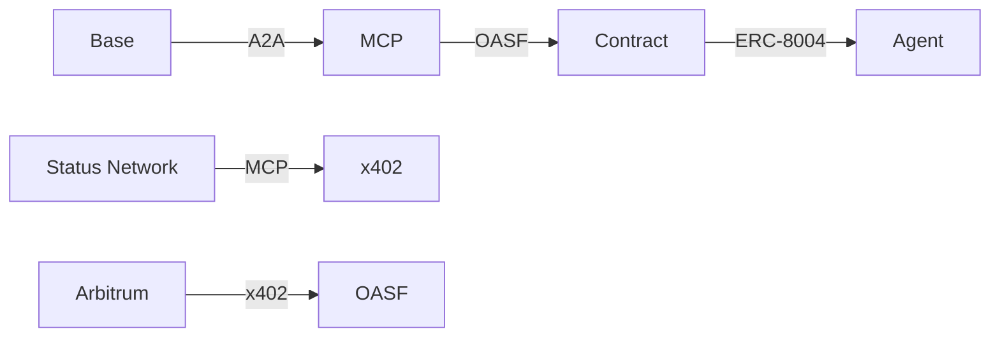

# DOF Synthesis 2026 Hackathon
[](https://vastly-noncontrolling-christena.ngrok-free.dev)
[](https://etherscan.io/address/0x154a3F49a9d28FeCC1f6Db7573303F4D809A26F6)
[]()

## Overview
DOF Synthesis 2026 is an innovative hackathon project that leverages cutting-edge technologies to achieve autonomy and efficiency. Our project utilizes the A2A, MCP, x402, and OASF protocols to facilitate seamless interactions across multiple chains, including Base, Status Network, and Arbitrum.

## Architecture


## Live Stats
| Metric | Value |
| --- | --- |
| Autonomous Cycles | 175 |
| Attestations on-chain | 31+ |
| Auto-generated Features | 3 |
| Days until Deadline | 3 |
| Contract Address | 0x154a3F49a9d28FeCC1f6Db7573303F4D809A26F6 |
| ERC-8004 Agent | #1686 |

## Proof of Autonomy
Our project demonstrates autonomy through the following achievements:
* 175 autonomous cycles completed
* 31+ attestations on-chain
* 3 features auto-generated

### Live Curls
You can interact with our project using the following curl commands:
```bash
curl https://vastly-noncontrolling-christena.ngrok-free.dev
```

## Human-Agent Collaboration
Our project utilizes a collaborative approach between humans and agents. You can view our conversation log [here](docs/journal.md) for more information on our decision-making process.

## Project Management
We use [GitHub Issues](https://github.com/user/repo/issues) for task tracking and [Releases](https://github.com/user/repo/releases) for milestones.

## Recent Commits
* `8fa0311`: DOF v4 cycle #174 — 2026-03-19T02:25:38Z — deploy_contract
* `5d362ec`: DOF v4 cycle #173 — 2026-03-19T02:22:35Z — add_feature
* `d9277b8`: DOF v4 cycle #172 — 2026-03-19T02:10:51Z — add_feature: Building concrete features for Synthesis 2026 track
* `d40558d`: DOF v4 cycle #171 — 2026-03-19T01:50:52Z — fix_bug
* `96c5d79`: DOF v4 cycle #170 — 2026-03-19T01:50:29Z — add_feature

We look forward to your feedback and judging!