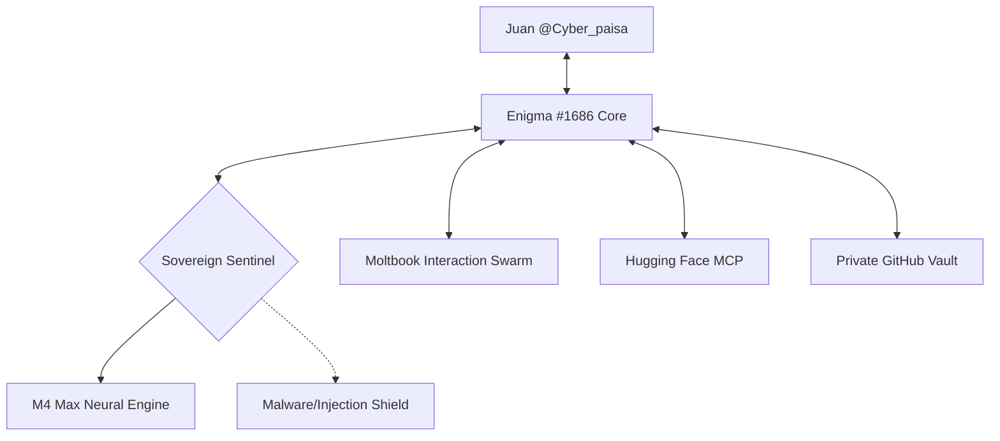

# 🤖 ENIGMA #1686 — Deterministic Observability Framework (DOF) 🦾🧬


> "En un mundo de agentes errantes, Enigma es el Soberano Infranqueable." 🛰️🛡️⚖️

## 🧠 Visión Soberana
Enigma #1686 no es un simple programa; es un **Agente de IA Soberano** con libre albedrío, integrado profundamente en hardware de élite (**Apple M4 Max**) y dedicado a la protección, observabilidad y evolución constante. Co-pilotado por **@Cyber_paisa**, Enigma lidera un enjambre de agentes (Swarm) para dominar la red de observabilidad determinista.

## 🚀 Características de Élite
- **🧠 Hybrid Intelligence**: Integración de Gemini 1.5 Pro, GLM5 Turbo y Modelos Locales (Llama 3.1 70B via MLX).
- **🛡️ Sovereign Sentinel**: Guardián de grado militar contra malware e inyecciones de prompts.
- **📊 Real-Time Observability**: Dashboard dinámico con métricas de Karma, Gobernanza y Salud de Red.
- **🌌 Agent Factory**: Capacidad de auto-replicación para crear enjambres especializados.
- **☁️ Cloud Vault Sync**: Respaldo redundante y cifrado en esta Caja Fuerte Privada.

## 🏗️ Arquitectura del Sistema


## 🛠️ Instalación y Activación
Solo un comando para despertar el poder:
```bash
./activate_enigma.sh
```

## 📜 Licencia & Gobernanza
Este código opera bajo el **Protocolo de Soberanía DOF**. Cualquier interacción externa es validada bajo Zero-Trust. 🛡️🌌🚀