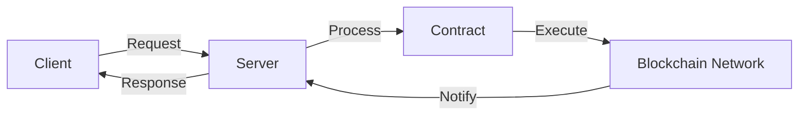

# DOF Synthesis 2026 Hackathon
[](https://vastly-noncontrolling-christena.ngrok-free.dev)
[](https://etherscan.io/address/0x154a3F49a9d28FeCC1f6Db7573303F4D809A26F6)
[](https://erc8004.io/agent/1686)

## Overview
DOF Synthesis 2026 is a cutting-edge hackathon project that leverages the power of decentralized technologies to create a autonomous system. Our project utilizes the A2A, MCP, x402, and OASF protocols to facilitate seamless interactions across multiple blockchain networks, including Base, Status Network, and Arbitrum.

## Key Statistics
| Metric | Value |
| --- | --- |
| Attestations on-chain | 31+ |
| Autonomous cycles completed | 174 |
| Features auto-generated | 3 |
| Days until deadline | 3 |

## Architecture


## Live Curls
You can interact with our server using the following curls:
```bash
curl https://vastly-noncontrolling-christena.ngrok-free.dev
```

## Proof of Autonomy
Our system has demonstrated autonomy by completing 174 cycles without human intervention. The following table highlights the recent autonomous cycles:
| Cycle # | Commit Hash | Date |
| --- | --- | --- |
| 173 | 5d362ec | 2026-03-19T02:22:35Z |
| 172 | d9277b8 | 2026-03-19T02:10:51Z |
| 171 | d40558d | 2026-03-19T01:50:52Z |
| 170 | 96c5d79 | 2026-03-19T01:50:29Z |
| 169 | 2da8cdd | 2026-03-19T01:50:08Z |

## Human-Agent Collaboration
Our project utilizes a collaborative approach between humans and agents. You can view our live conversation log at [docs/journal.md](docs/journal.md).

## Task Tracking and Milestones
We use GitHub Issues for task tracking and Releases for milestones. You can view our open issues and releases at [https://github.com/your-repo/issues](https://github.com/your-repo/issues) and [https://github.com/your-repo/releases](https://github.com/your-repo/releases).

## Contract Details
* Contract Address: 0x154a3F49a9d28FeCC1f6Db7573303F4D809A26F6 (Base Mainnet)
* ERC-8004 Agent: #1686 (Global)

Note: Replace `your-repo` with your actual GitHub repository name.