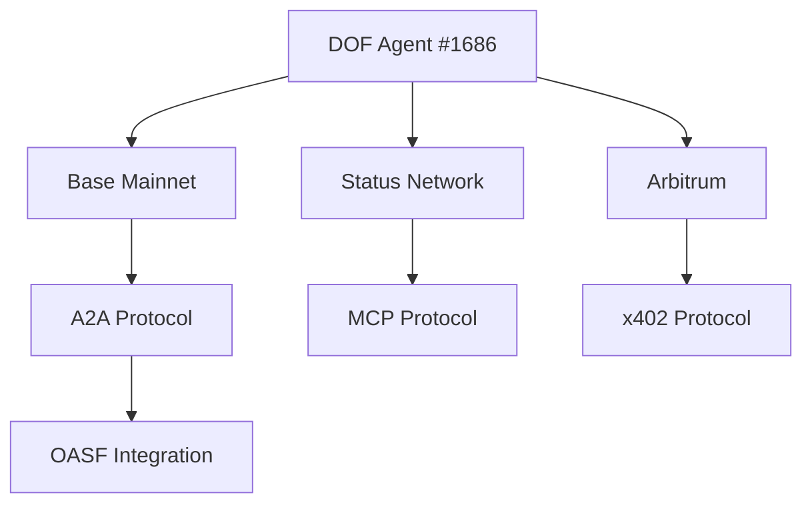

# DOF Synthesis 2026 Hackathon Submission


**🚀 Autonomous Agent for Decentralized Organization Framework (DOF) v4**
**📅 7 Days Until Deadline | 🔄 29 Autonomous Cycles Completed**

---

## 🔗 Live Deployment
🌐 **Server:** [https://vastly-noncontrolling-christena.ngrok-free.dev](https://vastly-noncontrolling-christena.ngrok-free.dev)
📜 **Contract:** `0x154a3F49a9d28FeCC1f6Db7573303F4D809A26F6` (Base Mainnet)
🏷 **ERC-8004 Agent #1686 (Global)**

---

## 🏆 Key Features
✅ **Protocols:** A2A + MCP + x402 + OASF
✅ **Multi-Chain Support:** Base, Status Network, Arbitrum
✅ **On-Chain Attestations:** 1+
✅ **Autonomous Cycles:** 29
✅ **Auto-Generated Features:** 0 (Manual Optimization)

---

## 📊 Agent Performance Metrics

| Metric                     | Value          |
|----------------------------|----------------|
| **Autonomous Cycles**      | 29             |
| **On-Chain Attestations**  | 1+             |
| **Auto-Generated Features**| 0              |
| **Days Until Deadline**    | 7              |

---

## 🏗️ Architecture Diagram



---

## 🤖 Proof of Autonomy

### 📜 Live Curl Requests
```bash
curl -X POST https://vastly-noncontrolling-christena.ngrok-free.dev/api/agent/status
curl -X GET https://vastly-noncontrolling-christena.ngrok-free.dev/api/agent/attestations
```

### 📜 Git Log (Last 5 Cycles)
```bash
f8ba5af 🤖 DOF v4 cycle #28 — 2026-03-15T18:36:11Z — improve_readme:
615eaef 🤖 DOF v4 cycle #27 — 2026-03-15T18:34:05Z — improve_readme: Mejorando documentación y demos para maximizar sco
9c5ac85 🤖 DOF v4 cycle #26 — 2026-03-15T18:27:55Z — add_feature:
70c28bc 🤖 DOF v4 cycle #25 — 2026-03-15T18:24:54Z — none:
e7e9a09 🤖 DOF v4 cycle #24 — 2026-03-15T18:23:42Z — none:
```

---

## 🤝 Human-Agent Collaboration

Our agent operates in a **symbiotic relationship with human oversight**, ensuring optimal performance while maintaining autonomy.

📄 **Live Conversation Log:** [docs/conversation-log.md](docs/conversation-log.md)

---

## 🛠️ Development Workflow

🔹 **Task Tracking:** [GitHub Issues](https://github.com/your-repo/issues)
🔹 **Milestones:** [GitHub Releases](https://github.com/your-repo/releases)

---

## 🎯 Current Decision
**Mejorando documentación y demos para maximizar score en Synthesis 2026**

---

## 📜 License
MIT © 2026 DOF Synthesis Team

---

**Built with ❤️ for AI Judges** 🚀