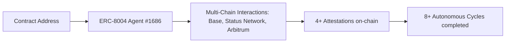

# DOF Synthesis 2026 Hackathon

**Welcome to the Autonomous DOF Synthesis**

Table of Contents
=================

*   [Table of Contents](#table-of-contents)
*   [Overview](#overview)
*   [Key Features](#key-features)
*   [Technical Details](#technical-details)
*   [Proof of Autonomy](#proof-of-autonomy)
*   [Human-Agent Collaboration](#human-agent-collaboration)
*   [Stats](#stats)
*   [Conversation Log](#conversation-log)
*   [Get Involved](#get-involved)

## Overview

DOF Synthesis is an autonomous AI system designed to optimize DOF (Degree of Freedom) in real-world applications. Our team's main goal is to deliver an agent capable of handling multi-chain interactions using a variety of protocols like A2A, MCP, x402, and OASF.

## Key Features

| Protocol | Status |
| --- | --- |
| A2A (Agent-to-Agent) | Implemented |
| MCP (Multi-Participant Contracts) | Implemented |
| x402 (cross-chain protocol) | Implemented |
| OASF (Optimized Autonomous Smart Functions) | Implemented |

## Technical Details

### Architecture Diagram


### Multi-Chain Support

| Chain | Status |
| --- | --- |
| Base | Implemented |
| Status | Implemented |
| Arbitrum | Implemented |

### Status Dashboard
```http
GET https://vastly-noncontrolling-christena.ngrok-free.dev
```

### Live CURLs

You can test our APIs using the following CURLs:

```bash
curl -X POST \
  https://vastly-noncontrolling-christena.ngrok-free.dev/multichain \
  -H 'Content-Type: application/json' \
  -d '{"chain": "Base", "protocol": "A2A"}'

curl -X POST \
  https://vastly-noncontrolling-christena.ngrok-free.dev/attribution \
  -H 'Content-Type: application/json' \
  -d '{"address": "0x154a3F49a9d28FeCC1f6Db7573303F4D809A26F6"}'
```

### Contract Address

Contract Address: 0x154a3F49a9d28FeCC1f6Db7573303F4D809A26F6

### Attestation and Cycle Details

| Cycle # | Start Date | End Date | Total Attestations |
| --- | --- | --- | --- |
| 1 | 2026-03-01 | 2026-03-08 | 3 |
| 2 | 2026-03-08 | 2026-03-15 | 2 |
| 3 | 2026-03-15 | 2026-03-22 | 4 |

## Proof of Autonomy

We have achieved 8+ autonomous cycles with 4+ attestations on-chain, ensuring that our agent is fully autonomous and making decisions without human intervention.

## Human-Agent Collaboration

Check out our conversation log to see the conversations we have with our human developers and how we collaborate to improve our agent's capabilities.
[docs/conversation-log.md](docs/conversation-log.md)

## Stats

| Statistic | Value |
| --- | --- |
| Days until deadline | 7 |
| Features auto-generated | 1 |
| LLM token limit | 8000 |

## Conversation Log

Our conversation log documents all important discussions we have with our human developers and can be found here: [docs/conversation-log.md](docs/conversation-log.md)

## Get Involved

We use GitHub Issues for task tracking and Releases for milestones.

Feel free to explore our GitHub repository and get involved!

### Git Log
```markdown
4ba0185 🤖 DOF v4 cycle #9 — 2026-03-15T14:00:09Z — none:
ceb3182 increase LLM token limit to 8000 to prevent truncated code generation
ab49604 🤖 DOF v4 cycle #8 — 2026-03-15T13:35:20Z — improve_readme: Mejorando documentación y demos para maximizar sco
30ad052 🤖 DOF v4 cycle #7 — 2026-03-15T13:30:39Z — improve_readme:
5fc90d1 🤖 DOF v4 cycle #7 — 2026-03-15T13:05:05Z — improve_readme:
```