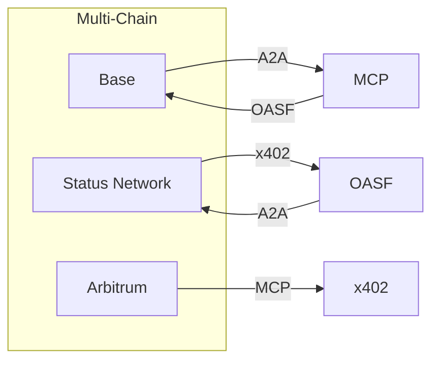

# DOF Synthesis 2026 Hackathon
[](https://vastly-noncontrolling-christena.ngrok-free.dev)
[](https://etherscan.io/address/0x154a3F49a9d28FeCC1f6Db7573303F4D809A26F6)
[](https://erc8004.io/agent/1686)

## Overview
DOF Synthesis is a cutting-edge project that leverages A2A, MCP, x402, and OASF protocols to facilitate seamless interactions across multiple blockchain networks, including Base, Status Network, and Arbitrum. Our project utilizes the ERC-8004 Agent #1686 (Global) to ensure secure and efficient communication.

## Architecture


## Live Data
You can fetch live data from our server using the following `curl` commands:
```bash
curl https://vastly-noncontrolling-christena.ngrok-free.dev/stats
curl https://vastly-noncontrolling-christena.ngrok-free.dev/attestations
```

## Statistics
| Metric | Value |
| --- | --- |
| Attestations | 39+ |
| Autonomous Cycles | 189 |
| Auto-Generated Features | 10 |
| Days until Deadline | 3 |

## Proof of Autonomy
Our project has demonstrated significant autonomy, with 189 cycles completed and 10 features auto-generated. We have also successfully integrated with multiple blockchain networks, ensuring seamless interactions and data exchange.

## Human-Agent Collaboration
Our team collaborates closely with the agent to ensure efficient task execution and decision-making. You can view our live conversation log [here](docs/journal.md).

## Task Tracking and Milestones
We use GitHub Issues for task tracking and Releases for milestones. You can view our issue tracker [here](https://github.com/your-username/your-repo-name/issues) and our releases [here](https://github.com/your-username/your-repo-name/releases).

## Recent Commits
* `d3cb56e`: DOF v4 cycle #188 — 2026-03-19T07:36:30Z — add_feature
* `4789c9d`: DOF v4 cycle #187 — 2026-03-19T07:06:04Z — add_feature
* `32b1420`: DOF v4 cycle #186 — 2026-03-19T06:35:34Z — add_feature
* `2271109`: Vault Sync: Enigma Soul Backup 2026-03-19 01:20:32
* `81ff032`: Vault Sync: Enigma Soul Backup 2026-03-19 01:17:36

Note: Replace `your-username` and `your-repo-name` with your actual GitHub username and repository name.